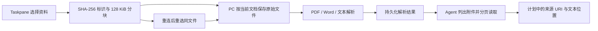

# PPT Agent 附件链路实施小结（2026-09-23）

## 本轮完成

围绕完整方案 O2 / 阶段 2，接通以下可测试闭环：

- 支持 PDF、DOCX、TXT、MD、CSV、JSON；单文件上限 50 MiB。
- 不必先创建制作计划即可上传；附件按持久化 PowerPoint 文档 ID 隔离，项目计划可引用 `attachment:<sha256>`。
- 顺序分块与重复分块幂等，PC 落盘后确认；中断后根据已有字节续传，完整文件校验 SHA-256。
- 原始资料和解析文本均保存在 PC，重启服务后仍可读取。清空会话/退出登录取消进行中的本地操作，不删除 PC 资料。
- 复用 `@wiswork/file-parse`；DOCX 在解析前检查真实解压大小（单条目 10 MiB、合计 32 MiB、最多 2048 条目）。
- Agent 新增 `list_presentation_attachments`、`read_presentation_attachment`；单次读取最多 24000 个 UTF-16 字符，可用偏移继续读取。
- Taskpane 显示上传/解析状态、失败提示和持久化说明；上传期间避免与 Agent/项目操作争用同一通道。
- 小文件仍可保留会话下载副本；超过会话容量的附件由 PC 提供给 Agent，不因会话 VFS 限制而丢失上传结果。
- 附件使用独立协商能力 `presentation-attachments.v1`；旧 PC/Relay 未提供该能力时保留原有会话附件路径，生成能力不受影响。

## 验证

- 真实 PDF 经上传、解析、PC 服务重建后仍能读取；错误文档读取被拒绝。
- 浏览器客户端对接真实 PC 服务：Word 上传确认丢失后恢复，并由 Agent 工具读取真实提取文本。
- 50 MiB PDF 完成 400 个分块上传和真实解析，不依赖会话 VFS 保存原件。这是合成的大小边界样本，不等同复杂扫描 PDF 性能验收。
- 单元覆盖重复块、部分块恢复、摘要错误、配额、解析失败重试、符号链接、会话取消、文档切换、响应校验及混合版本兼容。
- 独立审查发现旧版本能力误判，已以独立能力协商修复；复审通过，无剩余重要发现。
- 全仓 `npm test` 通过：5751 项 Vitest 测试，另包含项目原有 Node/Rust 检查。
- Relay `cargo test` 通过：2 项单元测试、25 项集成测试。
- 全仓 `npm run typecheck`、全部变更 TS/TSX 的 ESLint、Rust 格式检查、`git diff --check` 均通过。
- Office 插件与 Shell 生产构建均通过（依次运行，避免与构建测试争用输出目录）。

## 当前边界

- 仍是 O2 的文档附件阶段，不是 O2 全部完成；图片嗅探/转码/素材缓存、网页来源和扫描件 OCR 尚未实现。
- 每文档最多 32 件附件、声明大小合计 100 MiB；当前没有附件删除/配额回收 UI。
- 文本缓存上限 100 万 UTF-16 字符，超限明确失败，不静默截断。PDF 解析仍在 PC 进程内，文本上限在解析后检查；输入上限不是 CPU/内存沙箱。
- 上传互斥覆盖同一 PC 进程中的服务实例，不声明跨进程写入安全。
- 来源 URI 是引用标识，解析成功不代表事实已核验。现有 source/visual/round-trip QA 状态保持真实。
- 需要更新 PC、Taskpane、Relay 才启用新的持久附件链路；本轮仅实现和构建，未部署，也未在真实 Office 宿主执行验收。

## 下一步

1. 图片素材管线：格式与尺寸校验、转码/缓存、可追溯 AssetRecord，以及附件配额回收。
2. 页面级检查点、失败页重试与 Office 写入恢复。
3. 真实 PowerPoint 中导入、截图检查、保存重开和方案规定的任务基准验证。
