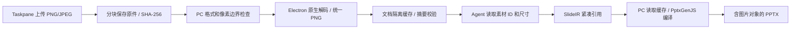

# PPT Agent 图片素材实施小结（2026-09-23）

## 已完成



1. **图片上传与规范化**：复用分块上传，支持 PNG/JPEG；解码前识别真实格式与尺寸，解码后验证尺寸，统一保存为 PNG。
2. **持久缓存**：保留原件摘要、缓存摘要、宽高和来源 URI；重启后可用，同一素材重用时不重复解码。缓存损坏、跨文档访问会被拒绝。
3. **轻量素材引用**：`PresentationAsset` 增加 `{id, attachmentId}`，Agent 无须把图片 base64 放进生成请求。PC 在编译时读取图片，回执仍保留紧凑引用。原有内联图片兼容保留。
4. **插件闭环**：图片资料入口、图片元数据清单、工具提示与引用生成均接通。原图适合保留会话副本时仍可下载。
5. **版本兼容**：独立协商 `presentation-assets.v1`；旧 PC 下图片保留原本的会话上传方式。旧文本附件清单不混入图片，新清单操作返回文本和图片。

## 验证证据

- 真实 Electron/Xvfb：PNG、JPEG 原生解码、转 PNG、无效输入拒绝通过。
- 实际 PptxGenJS 编译后解包：PPTX media 字节与缓存相符；服务重建后重新生成复用缓存，回执保留 attachmentId；错误文档引用被拒绝。
- 独立审查覆盖文档隔离、缓存摘要、尺寸边界、累计图片大小、取消、紧凑回执和旧版行为，无剩余重要发现。
- 全仓 `npm test` 通过：5781 项 Vitest 测试（另包含已有 Node/Rust 检查）；Relay 2 项单元 + 26 项集成测试通过。
- 全仓类型检查、变更文件 ESLint、Rust 格式、diff check，以及 Office 插件和 Shell 生产构建全部通过。

原生冒烟脚本：`apps/shell/tests/fixtures/presentation-image-smoke.cjs`。可从仓库根目录复现：

```bash
npx esbuild apps/shell/src/main/presentation-image.ts --bundle --platform=node --format=cjs --external:electron --outfile=/tmp/wiswork-image-normalizer.cjs
timeout 30s xvfb-run -a node_modules/electron/dist/electron --no-sandbox apps/shell/tests/fixtures/presentation-image-smoke.cjs /tmp/wiswork-image-normalizer.cjs
```

## 当前边界

- 原图最多 10 MiB，单边不超过 8192、总像素不超过 1600 万；规范 PNG 最多 4 MiB，单次生成图片合计最多 8 MiB。超限明确拒绝，不静默降质。
- 图片沿用每文档最多 32 件附件、100 MiB 声明容量，以及既有 IR 最多 32 个素材限制；尚未完成方案中无演示文稿级图片数量硬上限的目标。
- 本轮只支持 PNG/JPEG；WebP/GIF/SVG、远程素材下载、OCR/图片内容识别、素材删除与配额回收尚未实现。
- JPEG 解码后尺寸与头部不符时拒绝，部分带方向元数据的照片可能需先规范化后上传。
- 原生解码仍在 PC 主进程内，像素/文件上限不是独立进程沙箱。
- source/visual/round-trip QA 仍如实标记未核验/未执行；没有进行真实 PowerPoint 宿主导入、截图或保存重开测试。
- PC、Taskpane 与 Relay 均需新版本才能使用持久图片引用；回滚旧 PC 后，新版引用任务的继续编译不受支持，已保存成品仍可恢复。未部署或合并分支。

## 下一步

1. 页面级检查点、失败页重试及 Office 写入后的回读恢复。
2. 真实 PowerPoint 导入、截图、保存重开与任务基准验收。
3. 后续完善图片格式转换、素材检索/下载与配额回收。
