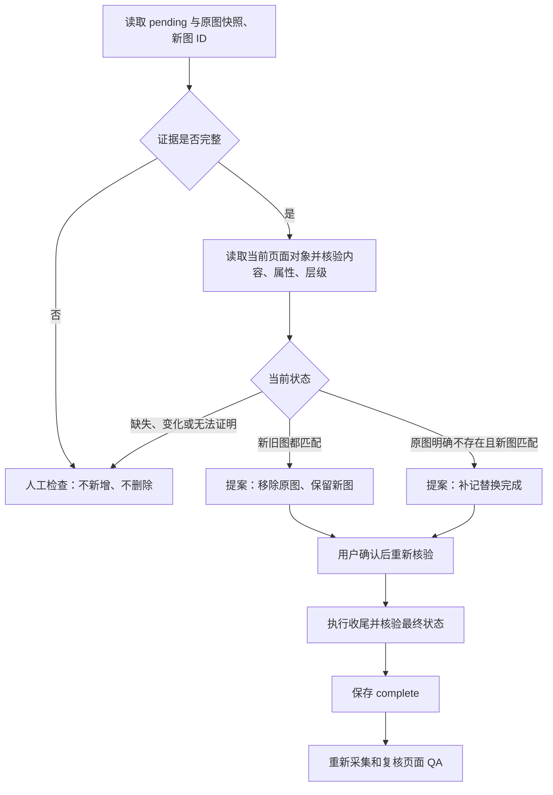

# PPT Agent：图片替换中断核验与恢复

日期：2026-09-23。基线 `5d4b8f0a`，实现分支 `codex/ppt-agent-implementation`。

## 本轮完成

- 新增 `inspect_presentation_image_replacement`：读取当前宿主对象，判断中断替换是否可以继续；与只读历史记录工具分开。
- 新增 `resume_presentation_image_replacement`：展示恢复动作并等待确认。重新核验记录、文档绑定与宿主状态后才执行。
- 新替换在首次 pending 时保存原图快照，包括媒体与图片语义 SHA256、几何、旋转、元数据和完整对象顺序。快照不可改写；不保存素材 base64。
- 恢复无需会话中的原始 VFS 素材，也不依赖浏览器图片解码功能。运行时重建后仍可根据文档中持久化的记录核验。

### 三种核验结果

| 结果              | 必须满足                                                     | 确认后的动作                             |
| ----------------- | ------------------------------------------------------------ | ---------------------------------------- |
| `ready_to_finish` | 原图指纹未变，新图内容与布局匹配，完整对象顺序正确           | 仅删除原图，再核验最终结果并保存完成记录 |
| `already_applied` | 成功读取对象列表证明原图不存在，新图内容、布局和最终层级匹配 | 重新核验并补记完成，不再次写入图片       |
| `manual_review`   | 缺少证据、对象缺失、属性或顺序变化等                         | 不创建恢复提案，交由人工检查             |

读取失败和取消不会被当作“原图已经不存在”。恢复不会新增图片，不会猜测未保存的对象 ID，不会自动删除候选图片。完成记录保存失败时保留 pending；下一次可以重新核验已应用状态，再确认补记。恢复仍触发既有 QA 失效机制，不会自动给出视觉通过结论。

## 兼容与边界

- 本轮之前的记录不包含原图快照，仍可读历史，但不能自动恢复；禁止事后补造快照。
- 插入后尚未保存候选 ID 的中断也只能人工检查。没有实现自动发现或清理“可能是本次插入”的图片。
- 保留 32 条、128 KiB 的日志上限及单条 16 KiB 限制，在首次写入时为候选 ID 预留空间。过大的快照在原生插入前拒绝。
- Office 没有提供这里所需的原子比较并删除能力；尽管反复核验，仍需真实 PowerPoint 验收并发编辑行为。
- 测试覆盖真实 PptxGenJS 包检查、模拟 Office 对象和完整运行时/设置保存流程，尚未完成真实 PowerPoint 验收。
- 未合并、推送或部署，保留隔离分支供继续开发。

## 验证

- 定向测试覆盖新旧图状态、缺失证据、属性/内容/层级漂移、取消、读取与删除失败、完成保存失败，以及重建运行时后无原始素材恢复。
- 独立复审未发现重要问题；5 个目标文件共 80 项测试通过。
- 全仓 `npm test` 通过：5,951 项 Vitest 测试，其中 Office 插件 767 项；其他脚本测试通过。
- 全仓 `npm run typecheck`、变更文件 ESLint 通过。
- Office 插件与 Shell 生产构建、`git diff --check` 通过。插件仍有大于 500 kB 的分包体积提示。

## 下一步

1. 做真实 PowerPoint 验收，覆盖 Office 图片扩展、媒体重新编码、层级、取消和完成保存失败。
2. 根据实机证据扩充兼容白名单，仍拒绝不能证明保真的裁剪/特效图片。
3. 完善人工检查入口，使缺少候选 ID 或快照的历史中断能明确定位到页面及已有记录。
