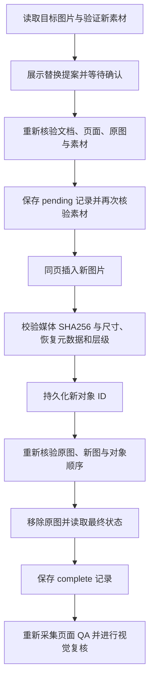

# PPT Agent：普通图片替换阶段进展

日期：2026-09-23。实现分支：`codex/ppt-agent-implementation`，本阶段基线：`6bd49bd2`。

## 已完成

新增 `replace_presentation_page_image`，使用业务页 ID 和原生图片对象 ID 定位，在现有确认机制内替换 VFS 中的 PNG/JPEG。页面 ID 保持不变；图片对象 ID 会变化。保留位置、尺寸、旋转、名称、替代文本及层级。新增 `read_presentation_image_replacement` 读取历史状态，在图片解码能力不可用时仍可查询。

候选图片验证通过且对象 ID 保存成功后，才允许删除原图。设置保存与已有导入/QA日志串行；日志阶段单调推进，最多 32 条、128 KiB，并在插入前为候选 ID 预留容量。首次保存失败不会开始图片写入；中断或结果不确定时保留 pending，禁止自动重复插图。完成记录再次请求时返回原结果。历史完成记录不表示当前视觉检查通过。

沿用确认前的 QA 失效机制。替换完成后必须重新采集和复核页面，不能沿用修改前的通过状态。

## 支持范围与限制

- Office.js PowerPoint API 1.10；普通顶层内嵌 PNG/JPEG；素材使用既有解码验证，最大 2 MiB。
- 导出的单页 OOXML 必须通过严格白名单。裁剪、特效、动画、链接、组合子图片及未知扩展等拒绝处理，避免静默丢失设置。非默认黑白渲染、旋转填充设置与显式 DPI 属性也受限制。
- 图片属性检查基于真实 PptxGenJS 生成包的解析测试；Office API 写入通过模拟宿主测试。尚未完成真实 PowerPoint 实机验收。Office 可能带有未支持的扩展，或重新编码媒体，导致保守拒绝/停止；媒体不一致时不会继续删除原图。
- 新增与删除不是原子操作。并发编辑或中断可能留下两个图片对象；不会猜测对象归属、自动删除未知对象或重复新增。
- pending 目前用于阻止重放与人工检查，尚未实现重启后的自动核验、继续执行或清理。素材仍来自当前 VFS，会话结束后可能需要重新上传。
- 不改变已有设置格式，也未合并、推送或部署。

Office API 依据：[Shape](https://learn.microsoft.com/en-us/javascript/api/powerpoint/powerpoint.shape?view=powerpoint-js-preview)、[ShapeZOrder](https://learn.microsoft.com/en-us/javascript/api/powerpoint/powerpoint.shapezorder?view=powerpoint-js-preview)、[Slide](https://learn.microsoft.com/en-us/javascript/api/powerpoint/powerpoint.slide?view=powerpoint-js-preview)。实现使用本地 SDK 可用的原生图片新增、对象属性及层级操作。

## 验证

- 定向 TDD 覆盖内容校验、复杂图片拒绝、层级保持、候选保存失败、取消、素材变化、文档切换、幂等与容量限制。
- 独立审查发现并关闭两处问题：pending 保存期间素材变化；允许无法保留的 OOXML 渲染属性。
- 独立复审：6 个目标文件、69 项测试通过。
- 全仓 `npm test` 通过：25 个 Vitest 工作区共 5,930 项测试（Office 插件 746 项），其他脚本测试也通过。
- 全仓 `npm run typecheck`、全部变更代码 ESLint、`git diff --check` 通过。
- Office 插件与 Shell 生产构建通过；插件构建仍有大于 500 kB 的分包体积提示。

## 下一步

1. 增加 pending 的只读核验：识别原图、新图是否存在及内容是否匹配，给出明确恢复选项。
2. 将可恢复步骤接入确认机制，保证恢复也不重复插入、不删除归属不明的对象。
3. 在真实 PowerPoint 中验收普通图片、带 Office 扩展的图片、层级保留和中断场景，据此调整兼容白名单。
