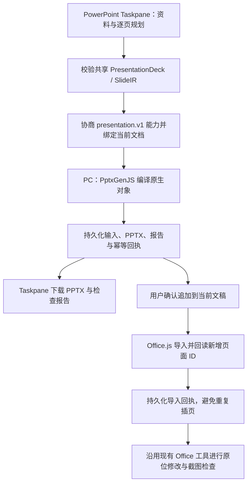

# PPT Agent 实施阶段报告 · 2026-09-23

## 状态与范围

**整体状态：进行中。** 本轮完成首段工程主链路，尚未达到完整 P0 或首批产品验收标准。

依据：`wiswork-ppt-agent-solution-and-implementation-plan-2026-09-22.md` v1.3。代码位于独立分支 `codex/ppt-agent-implementation`，评审基线为 `482dedf`；该基线保存了开始实施前已有的 ACP 改动。原工作目录保持不变。

## 本轮已交付

- **PptxGenJS 新建路径**：16:9 页面；原生文字、形状、表格、图表及 PNG/JPEG 图片；来源页脚；结构校验与几何问题报告。图片 cover 保持源比例。
- **持久化与恢复**：PC 保存版本化编译记录；同一请求重试返回原结果，冲突输入拒绝；Taskpane 可恢复当前文档的最近编译项目。
- **Office.js 交付**：确认后追加生成页面，保留现有页；保存写前预约和写后回执；宿主写入结果不确定时停止重复导入，不执行破坏性回滚。
- **连接隔离**：新增协商能力，旧客户端保留原路径；忽略旧连接消息和旧代理回调，防止污染新会话。
- **用户入口**：生成的 PPTX 与 JSON 报告可直接下载。生成物使用专属目录，避免覆盖同名上传附件；取消、退出和新任务会使旧请求结果失效。
- **现稿修改**：继续使用原有 Office.js / 受控 OOXML 工具及确认机制；本轮没有实现新的完整 ChangeSet 工作流。

## 验收证据

- 真实编译 8 页中文 fixture，并重新解析 PPTX，检查原生表格、图表和图片等结构。
- 端到端测试覆盖 Taskpane skill → PC service → PptxGenJS → 文件下载存储；注入首个响应丢失并重建服务，确认同一请求只编译一次；其他文档访问被拒绝。
- 回归测试覆盖迟到响应、取消、Save As 文档绑定、同名附件、导入重复调用、写入不确定、长文档标识、图片裁切和能力协商。
- 全仓类型检查通过；Taskpane 和 PC 生产构建通过；变更 TypeScript/TSX 文件 ESLint 通过。
- Relay Rust 测试 26 项、Clippy 和格式检查通过。依赖许可审计未完成，不作为本轮已通过的发布门槛。
- 全仓 `npm test` 通过（Vitest 合计 5671 项通过，含 Office 插件 547 项、PPTX 引擎 565 项；另外运行了脚本及 Sheets 原生测试）。隔离环境先补齐 Sheets 原生可执行文件和 Electron 运行时后，完整重跑成功。
- 两轮独立代码审查及修复已完成；最终异步生命周期边界的回归测试通过。

**验收边界**：上述 PPTX 重新解析是文件结构证据，Office 适配器测试使用 mock；没有真实 PowerPoint 的渲染、保存重开及手工编辑验收，也未执行 20 个真实专业任务的 16/20 交付基准。报告明确使用 `render: not_run`、`sources: not_verified`、`roundTrip: not_run`，不把编译成功计为完整验收通过。

## 未完成项与当前限制

| 原方案能力                                  | 状态   | 当前差距                                                                         |
| ------------------------------------------- | ------ | -------------------------------------------------------------------------------- |
| 阶段 0：真实任务基准、统一诊断与基线        | 进行中 | 只有工程 fixture 和故障注入；缺少 20–30 个真实任务、人工修正率与质量基线         |
| O0：多文档连接与安全自动恢复                | 进行中 | 已增强隔离；完整安全自动重连尚未完成                                             |
| O1：Presentation Project 与 Taskpane 项目化 | 进行中 | 有编译存储/回执；完整 Brief、ResearchLedger、SlideTask 状态迁移和时间线未完成    |
| O2：附件解析与素材管线                      | 未开始 | 新能力尚未接入 PC 大附件解析、分片上传、图片预取缓存                             |
| O3：双路径编译与连续生产                    | 进行中 | 新建编译和整套追加已实现；同一 IR 的 Office.js 对象级编译、逐页检查点/续跑未完成 |
| O4：分层 QA                                 | 进行中 | 结构与几何已覆盖；来源核验、渲染评审、宿主 RoundTrip、失败页修复闭环未完成       |
| O5 / P1：ACP 修改与撤销体验                 | 未开始 | 复用已有编辑工具；未交付新的完整 ChangeSet、项目时间线和撤销闭环                 |
| O6 / P2：兼容发布、品牌与规模化             | 未开始 | 未部署、未进行宿主兼容矩阵及品牌/团队能力验收                                    |

当前编译请求（含内联图片）上限 **256 KiB**，输出 PPTX 上限 **10 MiB**。因此尚不能承接方案中的完整 PDF/图片密集输入。导入记录每个文档最多 32 项，达到上限会明确失败，不静默删除用于防重的记录。Save As 后按新的文档身份处理，不自动继承原文档项目访问。

## 部署矩阵与回滚

本轮仅本地实现与验证，**没有部署或合并到原工作分支**。发布顺序应为 Relay → PC → Taskpane，三者兼容后才启用生成。

| 组件            | 是否更新 | 最低兼容要求                                                    | 部署方式                   | 回滚方式                                   |
| --------------- | -------- | --------------------------------------------------------------- | -------------------------- | ------------------------------------------ |
| Taskpane        | 是       | PC 与 Relay 协商 `presentation.v1`；导入要求 PowerPoint API 1.2 | 发布新静态 build           | 恢复上一 build                             |
| WisWork PC      | 是       | 配套 `presentation.v1` handler 与 PptxGenJS                     | 应用升级                   | 安装旧版；保留新增项目目录                 |
| Relay           | 是       | 协议 v1，允许 `presentation.v1` 能力                            | 更新服务                   | 回滚服务；新能力不再可用，原能力保留       |
| Manifest        | 否       | 运行时检测宿主 API                                              | 无新增安装动作             | 无                                         |
| Project schema  | 是       | 新增 presentation store v1                                      | 写入独立目录，不迁移旧项目 | 旧版忽略新目录；新代码拒绝未知版本而不改写 |
| Office settings | 是       | 文档身份、最近项目、导入回执 v1                                 | 使用文档 settings 保存     | 保留记录；不在回滚时删除防重回执           |

## 下一阶段入口

工程主链路已具备继续开发的基础；**完整 P0 的验收入口尚不满足**。按原方案“不静默进入下一阶段”的要求，本报告记录缺口，不能将本轮标记为阶段 0–4 全部完成。

后续应先补真实任务样本和诊断口径，再完成 O1 项目模型/时间线与 O2 附件、资产管线；随后推进页面级生产与真实宿主 QA。真实 Office 验收需要可用的 PowerPoint 测试环境与测试文稿，不能以 mock 或编译结果替代。
