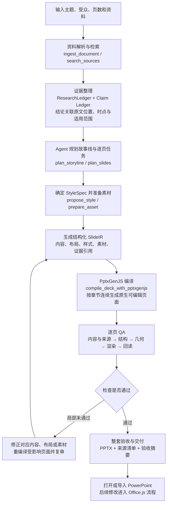
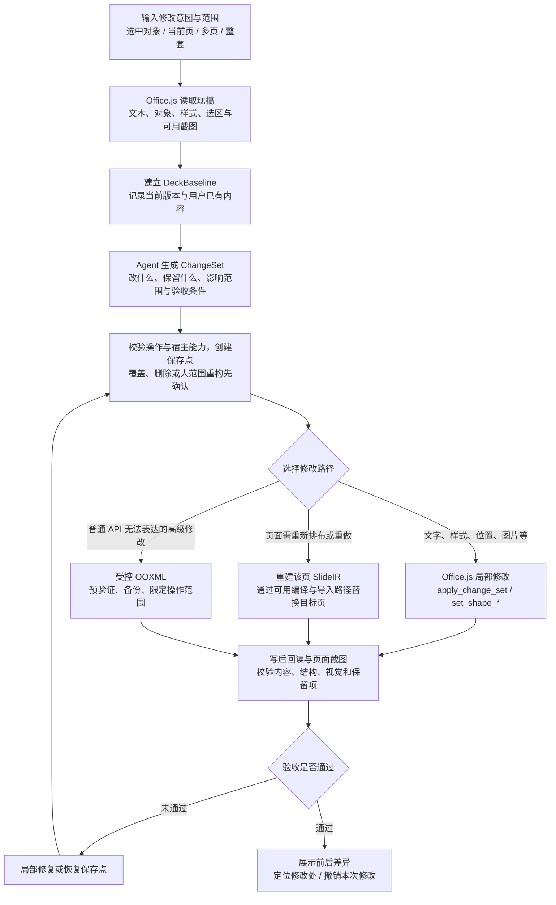

# WisWork PPT Agent｜核心流程与技术方案

> 基于完整方案 v1.3 提炼。聚焦从零制作与修改现稿，以及每一步使用的技术和工具。
> 下文工具名沿用原方案的目标接口，不代表全部已经实现；文档解析、搜索与图像处理复用已有能力，具体库由实现阶段确定。

## 1. 技术主线

**Agent 负责研究、规划和修复决策；结构化页面描述驱动确定性制作工具；程序检查与视觉模型共同验收。**

| 技术 / 模块 | 在方案中的职责 |
| --- | --- |
| Agent Harness + 大模型 | 调度工具、整理证据、规划故事线、选择版式、生成结构化页面描述、根据检查结果修复。 |
| 文档解析与来源检索 | 读取 PDF、Word、Markdown、网页等，保留原文位置，补充权威来源。 |
| Style & Layout Engine | 将字体、色板、网格、布局族、文本预算固化为可执行规则。 |
| Asset Pipeline | 搜索或生成图片，完成下载、验证、裁切、转码和缓存，登记来源。 |
| **PptxGenJS** | 新建整套 PPT 的默认编译器，输出原生文本、形状、表格、图表及图片。 |
| **Office.js** | 读取当前文稿和选区，执行现稿中的局部修改，并在宿主能力允许时读取对象和截图。 |
| **受控 OOXML** | 补足普通 API 无法安全表达的少量高级修改，例如特定母版或包结构操作；需专门验证。 |
| Quality Pipeline + 视觉模型 | 检查证据、对象结构、几何、真实渲染和重开后的可编辑性。 |
| Project Store + 回执 / 保存点 | 保存阶段产物、已完成页面和修改记录，支持续跑、去重和恢复。 |

## 2. 从零制作：资料 → 页面设计 → PptxGenJS → 验收

### 每一步实际产出什么

| 步骤 | 工具与处理 | 关键产物 |
| --- | --- | --- |
| 目标与资料 | `create_project`、`update_brief`、`ingest_document`；明确目标并解析资料。 | `DeckBrief` 与带页码 / 段落位置的文本块。 |
| 研究与证据 | `search_sources`、`build_research_ledger`；先用用户资料，必要时补充一手来源；区分事实、引文、计算、判断与假设。 | `ResearchLedger`、`Claim Ledger`。 |
| 故事线与页面任务 | `plan_storyline`、`plan_slides`；确定章节、每页结论、证据、页型和文字量。 | `Storyline`、`SlideTask[]`。 |
| 样式与素材 | `propose_style`、`search_images`、`generate_image`、`prepare_asset`、`validate_asset`。 | `StyleSpec` 与已就绪的 `AssetRecord[]`。 |
| 页面编译 | 将页面任务转成 `SlideIR`，由 `compile_deck_with_pptxgenjs` 生成 PPTX。 | 可编辑页面、制作回执、预览。 |
| 检查与交付 | `verify_sources`、`verify_geometry`、`review_slide`、`verify_roundtrip`、`verify_deck`。 | 验收记录、文件、来源与未解决项。 |

**SlideIR 是两条制作路径共用的页面描述。** 它记录页面上的文字、图表、表格、图片、坐标、样式和来源引用。模型输出经过校验的结构化数据，由编译器封装 PptxGenJS 调用，统一处理字体回退、图表、裁切、备注和来源脚注。

样式确定、素材就绪后立即开始真实页面生产，不增加固定样稿确认环节。用户可以在早期页面上纠偏；修改样式时保留研究与素材，只重编译受影响范围。

图片生成用于插画和视觉素材。承载事实的数据图表应从已记录的数据和计算结果生成原生图表，以便复核与编辑。

## 3. 修改现稿：读取基线 → 变更集 → Office.js → 差异与撤销

### 如何选择具体工具

| 修改需求 | 默认执行方式 | 必须保留或验证 |
| --- | --- | --- |
| 改标题、缩短正文 | Office.js；`set_shape_text`。 | 目标对象、相关来源及无关文字。 |
| 调整字号、颜色、位置、大小 | Office.js；`set_shape_style/geometry`。 | 品牌规则、无关对象和用户手工修改。 |
| 替换图片 | `prepare_asset` 先处理素材，再通过宿主适配器插入或替换。 | 目标区域、裁切效果、图片来源。 |
| 编辑图表或表格 | 优先修改原生对象的数据与格式；依据宿主能力选择可用实现。 | 数据口径、单位和原生可编辑结构。 |
| 重做单页 | 更新对应 `SlideTask` 与 `SlideIR`，编译或导入到指定页。 | 明确要求保留的内容、页面位置和相邻页风格。 |
| 特定母版或包结构修改 | 仅走经过验证的 OOXML 操作。 | 包结构完整、能够重开、存在恢复点。 |

**ChangeSet 把自然语言变成有边界的修改。** 例如“第 4 页更有冲击力”可以解释为：保留结论与数据、精简说明、放大主图、提高标题对比度；验收时同时检查这些目标及保留项。

执行前若发现用户已手工修改目标内容，应重新读取并调整变更集。写入超时后先查回执和当前文档状态，再决定是否重试，避免重复插页或覆盖新内容。

## 4. 两条流程共用的质量与恢复闭环

| 检查层 | 工具 / 方法 | 解决的问题 |
| --- | --- | --- |
| 内容与证据 | `verify_sources` + 页面任务核对。 | 结论缺失、来源错配、引用不准、单位或时点遗漏。 |
| 对象结构 | `read_slide_structure`。 | 缺页、对象丢失、图表或表格被错误图片化。 |
| 几何 | `verify_geometry`；依据坐标、边界与布局规则检查。 | 越界、遮挡、过密、字号过小；区分合法背景和真实碰撞。 |
| 真实渲染 | `screenshot_slide` → 截图资产 → `review_slide` / 视觉模型。 | 低对比度、字体替换、图片裁切和视觉层级问题。 |
| 保存后回读 | `verify_roundtrip`。 | 文件无法重开、对象结构变化、失去可编辑性。 |

验收记录绑定页面及其版本。页面修改后只失效相关检查；截图暂时不可用时保留待审状态并重试或使用备用导出路径。单页问题只影响该页及其依赖；全局样式问题才扩大返工范围。

每次制作或修改保存 `BuildReceipt`，记录目标页、操作、版本、对象和结果。`resume_project` 从已完成步骤继续，`retry_failed_step` 重试失败项，`restore_checkpoint` 恢复保存点。交付时明确区分已通过、待人工判断与无法核验的内容。

完整依据：[WisWork PPT Agent 完整方案与实施计划](./wiswork-ppt-agent-solution-and-implementation-plan-2026-09-22.md)。
