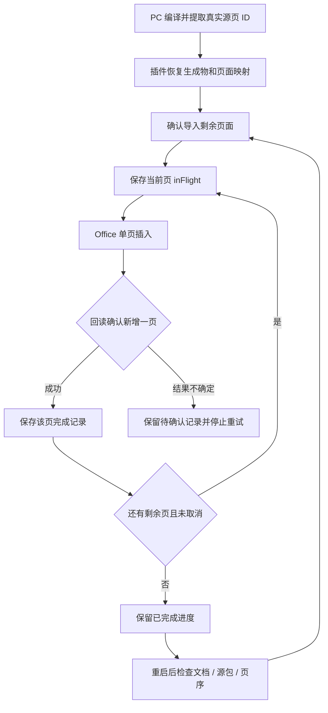

# PPT Agent 逐页导入恢复实施小结（2026-09-23）

## 本轮完成

- 从最终 PPTX 的 `ppt/presentation.xml` 提取实际源页面 ID；PC 回执增加页面标题、业务页 ID 和 Office 源页 ID 映射，恢复后仍可用。
- Office 导入改为已确认任务内逐页执行；每页写入前持久化 `inFlight`，回读确认后立即持久化完成记录。
- 取消与写入并发时，先回读已排队的那一页；确认成功则记录，再停止后续页。
- 可安全确认尚未写入的错误，保留此前完成记录；重试时重新确认，只导入剩余页。
- 结果不确定、回读失败或完成记录保存失败时保留保守标记，不自动重插、不删已存在页面。
- 继续导入前检查文档身份、源包 SHA-256、源页面顺序、原有页和已导入页的完整 ID 序列。
- 增加 `read_presentation_import_status`；Taskpane 显示每页已记录完成、待导入或结果不确定。
- 旧生成物没有页面映射时保留整稿导入；旧 pending/complete 防重复行为不变。

## 验证

- 真实八页 PptxGenJS 编译，实际 OOXML 源页 ID 与持久化页面映射逐项匹配。
- 跨层恢复：真实生成八页，模拟导入两页后安全中断，重建 PC 服务与插件设置绑定，恢复后只执行剩余六页；再次请求不重复插入。
- Office mock 验证 sourceSlideIds 单页选择器、targetSlideId、原有页保留与回读。此项不是 Office 实机验收。
- 覆盖取消竞态、未知写入、设置保存失败、源包变更、文档变更、宿主页序变更和旧协议兼容。
- 独立审查无剩余重要运行时问题。
- 全仓 `npm test` 通过：5810 项 Vitest 测试（另包含原有 Node/Rust 检查）。
- 全仓 `npm run typecheck`、变更文件 ESLint、diff check 通过；Office 插件与 Shell 生产构建均通过。

API 依据：[Microsoft：从另一个演示文稿插入幻灯片](https://learn.microsoft.com/en-ca/office/dev/add-ins/powerpoint/insert-slides-into-presentation)。源 ID 采用 `<numeric-id>#` 格式；不依赖 PptxGenJS 私有编号。

## 仍未完成

- 本轮是 **Office 导入阶段** 的页面检查点，PC 端编译仍按整稿执行，不宣称已实现独立页面生产/缓存/失败重编译。
- 有未确认写入标记的页不会自动恢复，仍需检查真实宿主状态；没有“凭新增页数猜测成功”的自动修复。
- 用户手动增删/重排页面后，当前严格基线会阻止继续，以保留已有内容；尚未实现智能重绑定。
- settings 保存依赖 Office 的文档设置 API；真正保存文件、退出 PowerPoint、重新打开后的恢复需要实机验证。
- 已记录完成只代表页 ID/数量回读成功，不代表截图质量、内容事实或保存重开验证通过。
- 未部署、合并分支或执行真实 Office 宿主测试；完整方案的基准任务验收仍未完成。

## 下一步

1. 接入宿主截图和结构检查，形成逐页 QA 状态与复核记录。
2. 在真实 PowerPoint 验证导入、取消、文件保存重开和不确定写入处理。
3. 完善页面级生产/失败重编译、原位修改与恢复体验。
