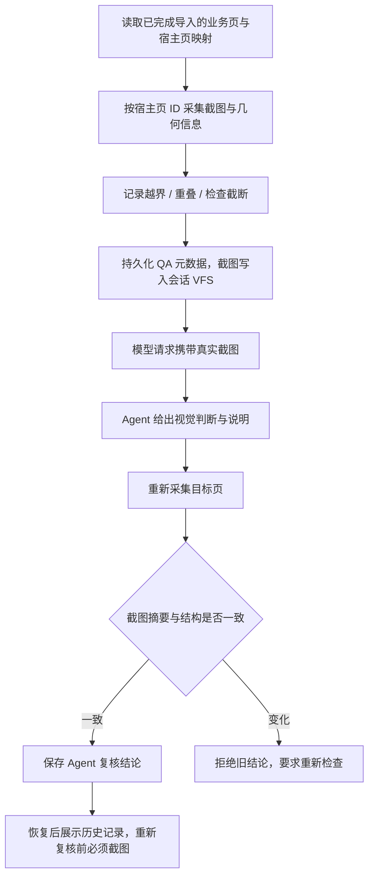

# PPT Agent 逐页 QA 实施小结（2026-09-23）

## 本轮完成

- 新增 `capture_presentation_page_qa`、`read_presentation_qa`、`record_presentation_page_review` 三个工具。
- 使用实际宿主页 ID 定位，支持第 20 页以后的页面；仅允许检查已确认导入完成的页。
- 截图与记录绑定文档身份、项目、生成请求、源 PPTX 摘要、业务页和宿主页 ID；防止错稿、错页及陈旧结论。
- 几何检查记录越界与重叠数量；采集或交叠结果被截断时明确标为检查不完整。几何重叠本身不等同设计错误。
- 视觉结论默认为待复核；复核记录明确标为 Agent 判断。记录前重新采集，截图或结构发生变化即拒绝旧判断。
- 文档设置只保存有界元数据，失败时恢复先前本地记录；截图及 QA JSON 写入会话文件系统。
- Taskpane 显示每页历史结构结果、视觉判断、说明和采集时间；项目恢复及会话清理时刷新视图。
- 修复 Office 模型请求层丢失工具图片的问题。当前工具轮携带真实图片，旧轮图片替换为明确的重新采集提示。
- 截图从宽 960 像素开始，按需逐级降低至 640/480/320/240，限制为 64 KiB；仍超限时报错。请求总量保持 256 KiB，按 UTF-8 字节检查，超限拒绝发送。

## 验证

- 全仓 `npm test` 通过：5838 项 Vitest 测试（另包含原有 Node/Rust 检查）。
- 全仓 `npm run typecheck`、全部变更 TypeScript 文件 ESLint、diff check 通过。
- Office 插件和 Shell 生产构建通过；Office 构建仍有现有大 chunk 提示。
- 覆盖精确宿主页定位、几何截断、未知页、取消、文档或源包变化、截图变化及设置保存失败。
- 使用高熵真实 PNG 测试降采样和超限拒绝；新增 QA 工具结果到模型请求图片块的跨层回归、旧图提示及 UTF-8 请求限额测试。
- 跨设置绑定恢复测试验证：采集 → Agent 复核 → 重建绑定 → 读取历史；没有新截图时不能重新提交结论。
- 独立审查发现并关闭图片未进入模型请求的 P1；修复后独立重跑 37 项相关测试通过，无剩余重要发现。
- 宿主相关测试使用 mock，不能替代真实 Office 验收。

## 边界

- Office 宿主采集使用 mock 验证；尚未完成真实 PowerPoint 的截图、持久化保存重开与视觉效果验收。
- 新 QA 依赖 PowerPoint API 1.10。源内容真实性、引用、完整性和保存重开保真仍分别保持未验证状态。
- 截图可能降采样，无法辨认的小字不能据此判为通过；建议每次采集并复核一页。请求历史过大时仍会明确超限失败。
- 恢复的是历史 QA 元数据，截图不会随文档设置跨会话保存。历史 Agent 通过不代表当前文稿通过。
- 仅检查已完成导入的页；原位修改后重绑定、自动修版、独立页面生产及失败重编译尚未完成。
- 本轮未部署、合并分支或推送远端。

## 下一步

1. 完善修改流程：将具体页面的问题关联到修改建议，修改后重新采集并更新 QA。
2. 在真实 PowerPoint 中验收导入、截图、取消、文档保存重开及恢复流程。
3. 继续补齐页面级生产、失败重编译与完整基准任务验收。
