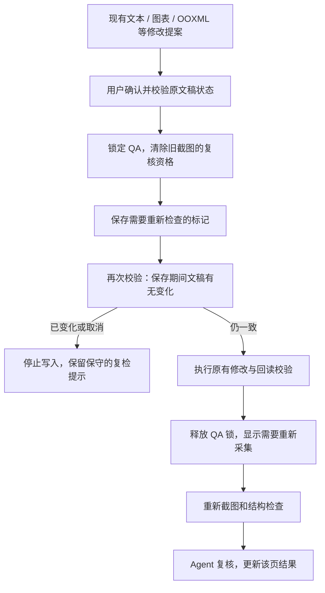

# PPT Agent 修改后复检实施小结（2026-09-23）

## 本轮完成

- 复用现有结构化修改提案，增加写入前后生命周期钩子。确认并校验通过后，先保存 QA 复检标记，再执行实际写入。
- 保存复检标记失败时，恢复先前本地设置并阻止文稿写入；写入失败或结果不确定时，保留需复检状态。
- 设置保存可能耗时，因此保存后再次校验原文稿状态；期间的手工修改或取消会阻止旧提案执行。
- 修改与 QA 采集/复核互斥；会话清理不会提前释放尚未结束的修改锁。提案拒绝和初次校验失败不触发失效标记。
- QA 记录新增可选 `recheckRequired: true`，保留旧截图摘要、结构及 Agent 判断作为历史。旧截图不能用于新复核，重新采集后清除该页标记。
- Taskpane 在折叠区外提示需重新采集的页数；单页记录将旧结构和视觉判断明确标为历史。
- 对不透明脚本、OOXML 与整稿变化，保守标记文档中全部已有 QA 页。不同项目和请求的历史记录一起处理，避免只使当前展示记录失效。
- 新增复检标记采用独立且有上限的字节预算，避免有效历史记录接近容量上限时阻止正常编辑；原有业务内容限额保持不变。

## 验证

- 定向回归验证修改前持久化、拒绝不失效、保存失败阻止写入、写入失败保留标记、锁释放以及修改后的新截图和复核。
- 新增临界64KiB/256KiB历史的失效、重新绑定读取、重复失效和原业务超额拒绝测试。
- 独立审查发现并关闭异步保存后的状态过期与容量临界问题；最终独立重跑26项相关测试通过，无剩余重要发现。
- 最终全仓 `npm test` 通过：5862 项 Vitest 测试（另包含原有 Node/Rust 检查），其中 Office 插件 678 项。
- 全仓类型检查、最终 Addin 类型检查、全部变更 TypeScript 文件 ESLint 和 diff check 通过。
- Office 插件与 Shell 生产构建通过；插件构建仍有现有大 chunk 提示。
- 宿主行为使用mock；这些测试不代表真实PowerPoint实机验收。

## 边界

- 这一步接通现有修改工具与复检，并未新增自动修版、变更集撤销或单页重生成。
- 本轮只覆盖通过结构化提案执行的 PowerPoint 修改；不监听宿主中用户手工修改事件。历史记录始终需要重采才能说明当前质量。
- 保守标记可能要求未受影响的页面也重新检查；有可靠修改范围后再缩小到具体页面。
- 会话内 PNG 与已导出的 QA JSON 是采集时的快照；当前复检要求以文档设置和 Taskpane 为准，重新采集会更新输出。
- Office 编辑和截图仍用 mock 验证；真实 PowerPoint 保存重开、平台 API 差异与视觉效果验收尚未完成。
- 旧版严格校验器不保证能读取带新标记的记录；不会通过自动删除标记来恢复旧的通过结论。
- 继续保留隔离分支，未合并、推送或部署。

## 下一步

1. 补齐业务页 ID 到原位修改目标的定位体验，减少 Agent 依赖页面索引，完善逐页问题到修复建议的衔接。
2. 在真实 PowerPoint 验收修改、取消、截图以及文件保存重开后的恢复。
3. 继续实施页面级生产、失败重编译与变更集恢复。
