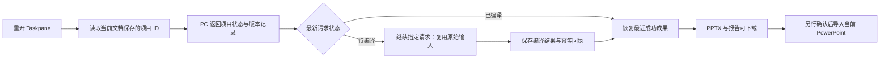

# PPT Agent 第二批实施报告：项目状态与直接恢复

## 状态

**本批状态：已完成。整体方案：进行中。**

本批继续原方案 O1 的项目可见性与恢复入口，复用第一批的编译回执和 Office.js 导入流程。基线 `d56e86d`，分支 `codex/ppt-agent-implementation`。原工作目录保持不变；未合并、未发布。

## 完成内容

| 能力           | 用户可见结果                                                            | 实现边界                                             |
| -------------- | ----------------------------------------------------------------------- | ---------------------------------------------------- |
| 项目卡         | Taskpane 显示最近保存项目的标题、页数、页面清单和最近 20 次编译请求记录 | 保存记录不是完整编辑历史；不代表页级施工进度         |
| 检查状态       | 显示结构、几何结果及未执行的渲染、来源、Office 往返检查                 | 最新待编译版本不借用旧版本的检查结果                 |
| 恢复成果       | 点击恢复最近成功版本，PPTX 和报告重新出现在下载入口                     | 不自动插入当前文稿；导入仍单独确认                   |
| 继续编译       | 从 PC 保存的原始输入继续指定请求，不需用户重述内容                      | 恢复粒度是整套编译请求，不是失败页                   |
| 首次失败恢复   | 编译发出前保存项目选择，响应丢失或编译失败后仍能找到请求                | 若 PC 未收到请求，会明确提示未找到，不伪造恢复状态   |
| 取消与文档隔离 | 取消、新任务、退出使迟到结果失效；切换文档后拒绝错配结果                | 取消停止等待和后续提交；已经完成的 PC 成果可再次查询 |
| 恢复操作互斥   | 恢复期间禁止发送/重试 Agent 任务，防止并行改写会话状态                  | 原有确认导入机制保留                                 |
| 兼容与错误提示 | 老 PC 不支持查询时提示升级，错误文案说明恢复动作                        | 不把不支持伪装为“没有项目”                           |

## 验收证据

- 新增后端测试覆盖：历史顺序和 20 条上限、明确请求续编译、进程重建、并发去重、取消、超限、跨文档拒绝、旧请求不覆盖新结果、未知字段拒绝。
- 浏览器回归覆盖：首次响应丢失前已保存项目、状态校验、取消/清空后的迟到响应、文档变化、老 PC 提示、恢复按钮及发送/重试互斥。
- 真实编译链路测试：首次编译失败 → 重建 PC 服务和 Taskpane → 查询到待完成请求 → 直接继续 → 生成并解析 8 页 PPTX → 再次恢复不重复编译。
- 独立审查发现恢复失败会改写项目选择的问题，已补充两个先失败后通过的回归测试并修复，复审无剩余重大问题。
- 最终全仓 `npm test` 通过（Vitest 合计 5697 项通过，Office 插件 568 项）；全仓 `npm run typecheck`、变更文件 ESLint、Taskpane 与 PC 生产构建、`git diff --check` 均通过。首次并行验证中构建测试触发 10 秒 hook 超时；结束其他验证后串行重跑完整套件通过，未放宽超时或修改测试断言。

**未做的验收**：本轮没有真实 PowerPoint 渲染、保存重开及手工编辑检查；没有新增真实专业任务基准。完整 P0、20 个任务中至少 16 个交付成功的目标仍未验收。

## 部署与兼容

- **PC**：需升级，新增 `presentation.v1` 下的 `status` / `resume` 操作，原 `compile` / `get` 保持兼容。
- **Taskpane**：需升级，新增项目卡、状态控制器和续编译工具。
- **Relay / Manifest**：本批不修改；仍要求第一批的 `presentation.v1` 支持。
- **项目数据**：沿用 receipt v1，无数据迁移。回滚代码保留所有记录，不删除防重回执。
- 发布顺序仍为先满足 Relay 能力，再升级 PC，最后发布 Taskpane；本轮没有实际部署。

## 下一步计划

1. **补齐 O1 项目模型**：持久化 DeckBrief、ResearchLedger/Claim Ledger、StyleSpec 与 SlideTask，让规划、制作和验收状态进入统一项目记录；将当前编译记录扩展为可解释的阶段进度。
2. **推进 O2 附件与素材管线**：分片上传、PC 解析 PDF/Word、资产缓存与元数据，解除目前 256 KiB 编译请求对大资料和图片任务的限制。
3. **完成页面级生产与真实宿主 QA**：逐页检查点、失败页恢复、截图审查和保存重开验证；用真实标准任务集评估首批交付率，再进入完整 P1 修改流程。

本批仅完成“项目可见、整套请求可恢复”的工程交付，不将其标记为完整 Presentation Project 或 O1 全部完成。
