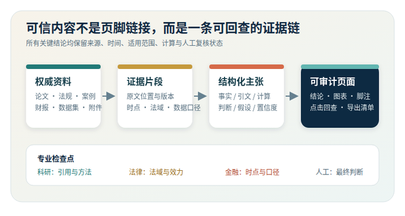
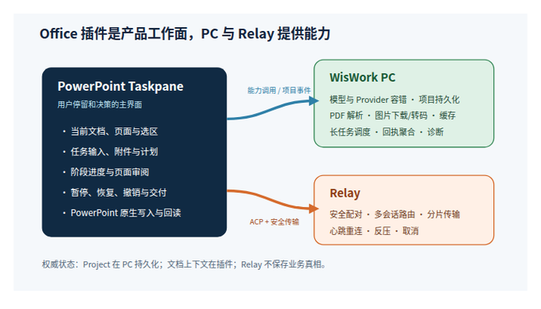
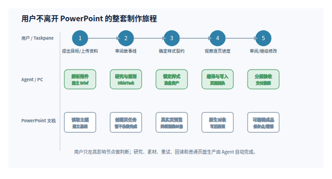
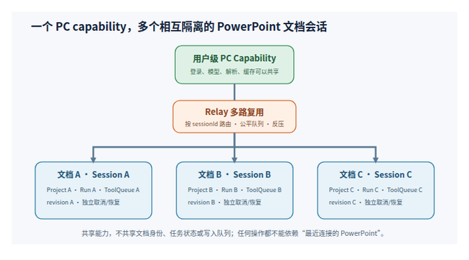
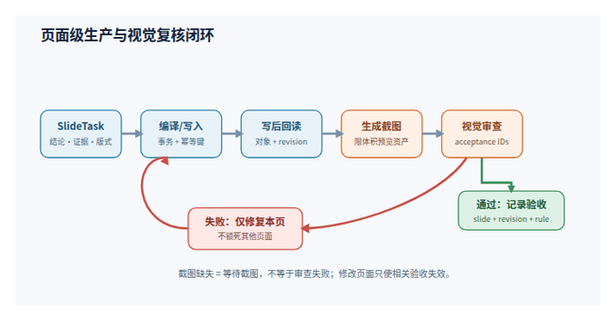
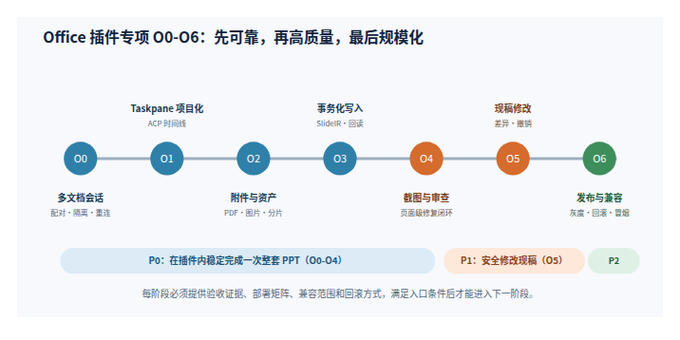
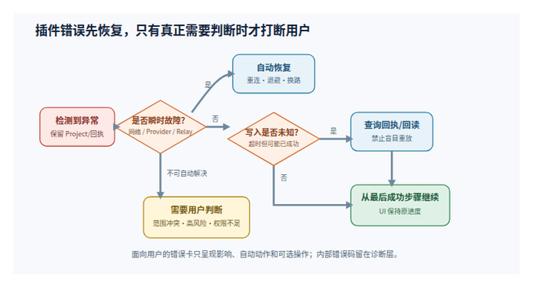

# WisWork PPT Agent 完整方案与实施计划

> 版本：1.3（双编译路径与连续生产版）  
> 日期：2026-09-22  
> 依据：《PPT Agent 产品与技术调研报告》及 WisWork 现有 PC、Office 插件、Relay、Agent Harness 能力  
> 文档性质：产品方案、目标架构、Agent 工作流和分阶段实施计划

## 0. 执行摘要

### 0.1 一句话方案

WisWork PPT Agent 以 **PowerPoint Office 插件为核心产品界面**，面向科研人员、律师、金融从业者及其他对信息可信度要求极高的专业人士，把论文、法规案例、监管文件、财报、数据集和现有页面转化为可编辑、可追溯、可审计、可恢复的专业 PPT。Taskpane 承担意图输入、证据审阅、过程展示与继续修改，WisWork PC 承担本地模型、文档解析、资产处理和长任务执行；系统不仅要“做得好看”，更要说明每个关键结论来自哪里、何时有效、适用于什么范围，以及哪些内容仍属于推断。

### 0.2 战略判断

PPT 制作不是一次“生成文件”的动作，而是一条长链路：理解目的、调查资料、组织故事、选择视觉系统、获取素材、逐页制作、检查事实、检查视觉、导出和反复修改。普通模板工具只能解决布局，单次大模型生成只能解决初稿，简单脚本难以应对不同资料、页面类型、宿主限制和中途失败。因此这是适合 Agent 的任务：它需要跨工具获取上下文、持续维护项目状态、根据页面结果做判断，并在失败后恢复执行。

### 0.3 核心产品决策

1. **项目优先，而非对话优先**：每次制作都有可持久化的 Brief、资料账本、样式规范、页面任务和制作回执。
2. **先规划和样式契约，再连续生产**：先确认故事线、StyleSpec 和内容边界，随后直接按章节生产并逐页检查；不设置额外样稿门槛，用户可随时在真实页面上纠偏。
3. **原生可编辑对象优先**：文字、形状、表格、图表尽量保持 PowerPoint 原生；SVG/位图只用于不要求局部编辑的视觉素材。
4. **资产先行**：网络图片不是写页过程里的临时调用，而是提前下载、验证、缓存、转码和记录来源的资产管线。
5. **验收分层且局部阻塞**：内容、结构、几何、渲染、可编辑性分别检查；某页截图失败只影响该页，不得把整个任务锁死。
6. **所有写入都可恢复**：以页面任务和幂等回执为单位续跑，不因连接中断、模型故障或宿主错误重复写入。
7. **插件是主工作面，PC 是能力底座**：用户尽量不离开 PowerPoint；PC 提供登录、模型、解析、缓存和可靠执行，不另造一套竞争性的 PPT 制作流程。
8. **同一 SlideIR，两条编译路径**：从零创建新演示文稿默认由 PC 使用 PptxGenJS 生成 PPTX；修改当前文稿继续使用 Office.js，必要时才使用受控 OOXML。两条路径共用规划、资产、样式和 QA 契约。
9. **证据先于表达**：关键主张先进入 Claim Ledger，并绑定来源、原文位置、时间、适用范围和页面；无法核验的内容不得包装成确定事实。
10. **专业判断有边界**：Agent 可以整理、计算、比较和起草，但法律结论、投资建议、原创科研判断等高风险输出必须显式标注依据、假设与人工复核状态。

### 0.4 目标结果

- 从主题、网页、PDF 或文档生成 8-15 页可编辑演示文稿。
- 在现有 PPT 中安全地修改指定页、统一风格、补充图片和重排内容。
- 用户能看到 Agent 当前阶段、正在处理的页面、依据、失败原因、恢复动作和剩余工作。
- 短暂网络、Relay、上游模型或 PowerPoint 宿主错误不会直接导致整单失败。
- 交付前提供事实来源、页面验收结果、未解决问题和回滚点。
- 关键结论、引文和数值可从页面反查到原始证据；计算可复现，时效与适用范围可见。

### 0.6 高可信专业内容定位

WisWork 不以“快速生成一套看起来合理的幻灯片”为终点，而是以“生成一套经得起追问的专业表达”为目标。系统必须在内容链路中明确区分：**原文事实、直接引文、计算结果、专业判断和待验证假设**。对于科研内容，重点检查引用、方法与数据口径；对于法律内容，重点检查法域、效力层级、生效时间和原文措辞；对于金融内容，重点检查报告期、币种、单位、数据来源、计算过程和信息时点。

可信度不能只靠页脚链接。每个关键主张都进入证据链：原始材料被解析为证据片段，证据片段支撑结构化主张，主张再映射到具体页面和图表。用户能在插件内从结论跳转到原文，也能看到冲突来源、过期信息、弱证据和仍需人工判断的内容。



### 0.5 产品重心与入口关系

本方案明确把 Office 插件设为第一优先级：

- **PowerPoint Taskpane 是产品本体**：发起任务、上传资料、使用当前文档/选区、查看计划、观察真实页面的逐页进度、处理异常、撤销和继续修改都在插件内完成。
- **WisWork PC 是可信本地执行节点**：负责认证、模型调用、PDF/文档解析、图片下载与转码、缓存、持久化项目、长任务调度和诊断，不要求用户频繁切换到 PC。
- **Relay 是连接设施**：负责插件与已登录 PC 的安全配对、路由、分片、重连和取消；不保存页面生产的权威业务状态。
- **PowerPoint 文档是最终工作区**：用户可随时手工编辑；Agent 必须感知手工修改并避免用陈旧状态覆盖。

因此，后续版本优先级以 Taskpane 端到端可用性为准，而不是以 PC 单独生成 PPTX 的能力为准。



---

## 1. 调研结论如何转化为 WisWork 设计

| 产品/方案 | 值得学习的机制 | WisWork 采用方式 | 不直接照搬的部分 |
| --- | --- | --- | --- |
| Claude Code PPTX Skill | PptxGenJS、OOXML、渲染检查、文件级生成和编辑 | 将页面规划编译为原生 PPT 元素；必要时使用 OOXML 修复；交付前做结构与渲染检查 | 不把命令行工程暴露给普通用户 |
| ChatGPT PowerPoint 插件 | 在 Office 内选择性读取、修改、截图与复核 | 保留插件内原位编辑和局部读取；统一接入项目状态与页面回执 | 不依赖无状态、多轮工具调用维持长任务 |
| 扣子 | 项目目录、style lock、逐页任务、自动质检 | 采用 StyleSpec 和 SlideTask；样式契约确定后按章节生产 | 不把整页 SVG 作为默认交付，避免失去编辑性 |
| Cheso | 研究先行、资料稿、提纲与风格确认、逐页预览 | 引入 ResearchLedger、Storyline 和可检查页面任务 | 内部工具不可验证的部分只作流程参考 |
| Genspark | Guide Mode、首屏确认、区域/批量修改、Fact Check、历史版本 | 提供引导式入口、轻量样式确认、选择区域修改、来源核验、保存点 | 不默认全量并行生成；复杂图表不能以“看起来正确”代替 PowerPoint 回读 |
| WisWork 现有能力 | PC `build_deck`、DESIGN.md、Office 工具、截图审查、几何检查 | 收敛为统一 Presentation Project 和可恢复生产流水线 | 删除互相打架的门禁和全局锁；不再让错误码成为用户流程 |

### 1.1 最重要的共同规律

- 高质量结果来自“先定义内容关系，再决定版式”，而不是先选一个模板。
- 风格一致性不是靠最后修，而是靠 StyleSpec、共享组件、连续生产和逐页视觉回读控制。
- 图像生成、图片搜索和插入是三个不同环节，必须有缓存、来源与格式验证。
- 自动检查必须覆盖真实视觉和 PowerPoint 回读；只检查 JSON 或坐标不足以证明可交付。
- 修改现稿与从零生成是两条不同工作流，不能共用同一套粗暴的“重做整页”策略。
- 用户信任来自阶段可见、依据可见、修改可撤销和失败可恢复，而不是更频繁的确认弹窗。

---

## 2. 产品范围

### 2.1 主要用户

**第一优先级：科研人员。** 包括高校与研究机构研究者、研发人员、医学与技术专家。他们需要把论文、实验记录、数据集和文献综述转成组会、答辩、会议和项目汇报；最在意引用是否准确、图表是否忠于数据、方法和局限是否被完整表达。

**第一优先级：律师与法律专业人士。** 包括诉讼、交易、合规、知识产权和企业法务。他们需要制作案件汇报、法律研究、尽调、监管更新和客户简报；最在意法域、效力层级、生效时间、精准引文、保密边界及“事实与法律判断”的区分。

**第一优先级：金融从业者。** 包括投研、投行、资管、风控、审计和企业财务。他们需要制作行业研究、投资备忘录、业绩分析、估值与风险汇报；最在意数据时点、币种和单位、财报口径、计算可复现性、来源权威性及合规披露。

**扩展用户：咨询顾问、政策研究者及其他知识密集型专业人士。** 他们与上述用户共享同一核心诉求：在有限时间内把大量异构资料压缩成清晰表达，同时不牺牲证据、审计性和专业判断边界。

这些用户通常已经能够制作 PPT，真正缺少的不是一个模板库，而是可靠的研究整理、证据核验、结构设计、可编辑生产和审阅闭环。视觉质量是专业可信度的一部分，但不能以牺牲原始信息准确性为代价。

### 2.2 核心任务

1. 从零制作：从一句目标、资料包或 PDF 形成完整演示文稿。
2. 修改现稿：修改内容、补页、重构故事、统一视觉、替换图片或修复问题。
3. 研究转演示：对指定主题或资料做证据化研究，再形成带来源的 PPT。
4. 模板/品牌生产：在指定母版、字体、色板和组件约束下完成内容填充。
5. 专业证据审阅：从页面结论回看原文、检查引用与数据口径、处理冲突来源并导出审计清单。

### 2.3 暂不作为首版目标

- 替代 PowerPoint 的完整手工编辑器。
- 对所有动画、SmartArt、第三方字体和复杂嵌入对象提供完美支持。
- 无确认地发布、发送或覆盖用户的最终文件。
- 用一套固定模板覆盖所有行业和表达目的。
- 以图片化整页掩盖可编辑性问题。

---

## 3. Agent 产品设计六维评估

| 维度 | 目标设计 | 成功信号 | 主要风险 |
| --- | --- | --- | --- |
| 目标理解 | 先形成 DeckBrief，明确受众、场景、时长、页数、立场、来源和品牌约束 | 用户对计划的修改集中在少数关键字段 | 追问过多，用户还没开始就疲劳 |
| 工作流嵌入 | PC 负责项目与长任务；PowerPoint 插件负责原位读取、编辑、预览和选区操作 | 用户无需在多个工具间搬运文件与提示词 | PC 与多文档插件会话错配 |
| 信任曲线 | 先展示计划与样式契约，再持续展示真实页面；有证据、回执、保存点和撤销 | 用户能早期纠偏且无需额外等待样稿 | 首批页面方向错误会产生局部返工 |
| 认知减负 | Agent 自动完成资料归纳、页面拆解、素材准备、重复排版和检查 | 用户关注内容判断，不需监工每个工具调用 | 用户被大量技术日志淹没 |
| 行动可观察 | 时间线显示阶段、页码、证据、变更、重试与剩余项 | 用户能在 10 秒内判断“现在做到哪、为什么停” | 只显示流水账，不显示产品语义 |
| 有界自治 | 低风险可逆操作自动执行；覆盖文件、删除内容、外部发布需要确认 | 中断少、回滚率低、确认集中在真正高风险点 | 无效确认太多或风险动作过度自动化 |

---

## 4. 统一产品模型：Presentation Project

从零制作和修改现稿都落在同一个项目模型中，区别仅在初始基线和动作范围。

### 4.1 核心对象

```ts
interface PresentationProject {
  projectId: string
  mode: 'create' | 'revise'
  brief: DeckBrief
  research: ResearchLedger
  style: StyleSpec
  baseline?: DeckBaseline
  storyline: Storyline
  slideTasks: SlideTask[]
  assets: AssetRecord[]
  receipts: BuildReceipt[]
  reviews: ReviewRecord[]
  checkpoints: ProjectCheckpoint[]
  status: ProjectStatus
}
```

### 4.2 DeckBrief

包含：目标、受众、使用场景、演讲时长、页数区间、语言、表达立场、必须包含/禁止出现内容、数据时效、引用要求、品牌与模板、输出格式。

原则：只询问会改变方案的高影响问题。其余字段由 Agent 给出默认值并明确展示。

### 4.3 ResearchLedger

每条事实记录来源、检索时间、引用片段、可使用页面、可信度和时效性。用户提供的资料与网页研究必须区分，推断必须显式标注。

在高可信场景中，ResearchLedger 之上增加 Claim Ledger。它不是另一份文案，而是页面结论与证据之间的机器可检查契约：

```ts
interface ClaimRecord {
  claimId: string
  statement: string
  type: 'fact' | 'quote' | 'calculation' | 'judgment' | 'assumption'
  sourceRefs: string[]
  sourceTier: 'primary' | 'authoritative_secondary' | 'secondary' | 'unverified'
  asOf?: string
  jurisdiction?: string
  calculation?: { formula: string; inputs: string[]; unit?: string; currency?: string }
  slideRefs: string[]
  confidence: 'high' | 'medium' | 'low'
  reviewStatus: 'machine_checked' | 'human_reviewed' | 'needs_review'
}
```

来源缺失、时点过期、口径冲突和推断越界必须成为结构化状态，而不是藏在备注中。

### 4.3.1 不同专业领域的来源策略

| 领域 | 优先来源 | 必须保留的上下文 | 自动警告条件 |
| --- | --- | --- | --- |
| 科研 | 原始论文、官方数据集、学术机构与标准组织 | DOI/版本、样本、方法、统计口径、限制 | 仅引用二手解读；图表与原始数据不一致；结论超出论文范围 |
| 法律 | 官方法条、司法机关案例、监管机构文件、正式合同材料 | 法域、效力层级、生效/失效时间、案号、原文位置 | 非现行规则；跨法域套用；删改限定语；把分析写成确定结论 |
| 金融 | 监管披露、交易所、审计财报、公司 IR、权威市场数据 | 报告期、as-of、币种、单位、会计口径、计算公式 | 时点混用；口径不可比；单位/币种缺失；未经支持的预测或建议 |

### 4.4 StyleSpec

不是模糊的“科技风”，而是可执行约束：色板、字体栈、字号层级、网格、边距、图片处理、图表规范、卡片样式、页码和来源样式、允许的布局族、禁用模式。

### 4.5 SlideTask

每页是一份可执行施工单：页面目的、核心结论、内容证据、版式族、文本预算、资产需求、预期对象结构、验收条件、依赖页面、制作状态。

### 4.6 AssetRecord

记录来源 URL、本地缓存、媒体类型、像素、比例、许可/署名、哈希、转码结果和使用页面。相同图片只下载一次；不合格素材在写页前淘汰。

### 4.7 BuildReceipt

每次写入记录宿主、文档、页、操作摘要、幂等键、写前/写后版本、对象 ID、结果和可回滚信息。它是恢复任务和避免重复写入的核心。

---

## 5. 从零制作 Agent 流程



### 阶段 A：意图与材料接收

**用户看到**：简洁的任务卡，显示受众、场景、页数、语言、资料和交付要求。  
**Agent 行动**：读取上传文件、当前 PowerPoint、历史品牌偏好；生成 DeckBrief。  
**证据**：材料清单、无法读取的文件、关键默认值。  
**检查点**：只有受众、场景、品牌、数据时效等高影响冲突才询问用户。  
**失败恢复**：单个附件解析失败不终止任务，显示原因并提供 PC 解析、纯文本提取或跳过选项。

### 阶段 B：研究与事实账本

**用户看到**：研究进度、来源数量、主要结论与争议点。  
**Agent 行动**：从提供材料优先提取；必要时搜索权威来源；合并重复证据；标记不确定性。  
**证据**：ResearchLedger 和可点击来源。  
**检查点**：高风险、时效性或相互矛盾的事实需要用户决策。  
**失败恢复**：检索不可用时继续使用现有材料，明确降低的覆盖范围，不虚构来源。

专业资料默认采用“用户资料优先、权威一手来源补充”的顺序。搜索结果摘要不能直接成为证据；必须落到可定位的原始页面或数据记录。存在冲突时保留双方证据，由 Agent 解释冲突原因和影响，不自行挑选更符合叙事的一方。

### 阶段 C：故事线与逐页施工图

**用户看到**：章节结构、每页一句话结论、页型、预计图表/图片。  
**Agent 行动**：先确定叙事逻辑，再拆分 SlideTask；控制信息密度与节奏。  
**证据**：页级计划与内容来源映射。  
**检查点**：用户可调整顺序、删页、锁页、指定重点。  
**失败恢复**：修改计划不清空研究和资产，只重算受影响页面。

### 阶段 D：样式契约与连续生产启动

**用户看到**：一张紧凑的视觉规范卡，包含字体、色板、网格、图片策略、图表规范和 2-3 个组件缩略示例。  
**Agent 行动**：根据品牌资产和内容类型生成 StyleSpec；完成资产预取后立即开始真实页面生产。  
**证据**：可执行的设计 token、布局族、文本预算和图片裁切规则。  
**检查点**：只有品牌冲突、多个视觉方向差异显著或用户明确要求时才询问；默认采用推荐方案继续。  
**失败恢复**：用户对首批真实页面提出修改时，只更新 StyleSpec 并重编译受影响页面，不清空研究、资产和已通过页面。

### 阶段 E：资产预取与页面生产

**用户看到**：按章节的生产进度，例如“第 2 章 3/4 页，2 张图片已验证”。  
**Agent 行动**：先完成图片下载、转码、裁切与引用登记；再将 SlideTask 编译为原生 PowerPoint 对象；写入后回读。  
**证据**：逐页 BuildReceipt、对象清单、失败重试。  
**检查点**：正常页面不逐页确认；涉及覆盖锁定页、删除用户内容或改变模板时确认。  
**失败恢复**：失败页进入重试队列，其余页面继续；恢复时从最后成功回执继续。

### 阶段 F：分层验收

验收顺序固定为：

1. 内容完整性：每个 SlideTask 的主张、证据和必需内容是否存在。
2. 结构正确性：页数、顺序、对象类型、来源和备注是否正确。
3. 几何检查：越界、遮挡、过密、最小字号和安全区。
4. 渲染检查：截图中的对比度、视觉层级、图片裁切、字体替换。
5. PowerPoint 回读：保存、重开后对象是否仍可编辑，图表/表格是否保持结构。
6. 演示检查：缩略图节奏、章节一致性、演讲备注与预计时长。

单页失败只阻塞该页和依赖它的页面；全局样式缺陷才触发章节或整套返工。

### 阶段 G：交付

**用户获得**：PPTX、可选 PDF、来源清单、验收摘要、未解决警告、保存点和后续修改入口。  
**禁止**：在未完成关键验收时用“已完成”掩盖缺页、图片失败或不可编辑对象。

交付包还应包含机器可读的 Claim Ledger 和面向人的证据清单。对于高风险内容，交付摘要必须单列“已核验”“待人工判断”“无法核验”三类，而不是把警告埋在日志中。

---

## 6. 修改现有 PPT 的 Agent 流程

### 6.1 先建立基线

Agent 首先读取：页面结构、母版/尺寸、字体、色板、对象类型、选中页/选区、备注、已有来源和当前截图。生成 `DeckBaseline`，不立即写入。

### 6.2 把自然语言变成变更集

```ts
interface ChangeSet {
  scope: { slideIds: string[]; shapeIds?: string[] }
  intent: string
  operations: PlannedOperation[]
  preserved: string[]
  validation: AcceptanceRule[]
  risk: 'low' | 'medium' | 'high'
}
```

例：“把第 4 页做得更有冲击力”不能直接重做。Agent 应先解释为：保留结论和数据，压缩说明文字，主图扩大，提升标题对比度，不改变品牌色与页脚。

### 6.3 选择最小修改路径

- 文本小改：使用原生 Office 文本/样式工具。
- 几何和样式：修改目标形状，保留无关对象。
- 图表/表格：优先编辑原生数据和格式。
- 复杂但可重建页面：以 SlideTask 重编译单页。
- OOXML：只用于普通 API 无法安全表达、且已有专门验证的操作。
- 整页栅格化：仅作为明确告知的预览或不可编辑交付，不作为默认修改结果。

### 6.4 修改后的验收与撤销

每个 ChangeSet 都要有写前保存点、写后截图、目标对象回读和可撤销记录。验收只覆盖受影响页面及与其共享样式的依赖页面，避免修改一页却要求整套重新过门禁。

---

## 7. 用户交互与 ACP 事件层

ACP 在本方案中不是新的业务逻辑，而是 Agent 与 Client 之间统一的过程事件与人机交互协议。业务状态仍由 Presentation Project 管理，ACP 负责把状态可靠地呈现给 PC 与 Office 插件。

### 7.1 用户可见的语义事件

- `project.created`：项目和目标已建立。
- `research.started/completed`：研究范围、来源和结果。
- `plan.proposed/revised/approved`：故事线和页面计划。
- `style.proposed/approved`：视觉方向与 StyleSpec。
- `slide.queued/building/rendered/reviewed/failed`：逐页生产状态。
- `asset.fetching/ready/rejected`：素材状态。
- `checkpoint.created/restored`：保存点和恢复。
- `attention.required`：确实需要用户判断的阻塞。
- `project.completed/completed_with_warnings`：完整交付或带警告交付。

### 7.2 进度展示规则

1. 默认展示产品语义，不把 `tool_call_in_progress`、内部 JSON 和错误堆栈直接抛给用户。
2. 同类细粒度事件折叠为页面或章节进度；诊断信息保留在可展开区域。
3. 错误消息必须包含：影响范围、已完成工作、自动恢复动作、用户是否需要介入。
4. 重试不重复创建用户可见步骤；恢复后继续原进度。
5. PC 与同一用户打开的多个 Office 文档各自拥有独立 Session，但共享已登录 PC 能力；不得出现一个增强模式、另一个标准模式的竞争状态。

### 7.3 人机检查点

只在以下情况打断用户：

- 目标或资料存在会改变结论的冲突。
- 品牌规则存在冲突，且不同选择会显著改变整套视觉方向。
- 将覆盖、删除或大范围重构用户现有内容。
- 来源不可核验但结论风险较高。
- 需要发布、发送、覆盖最终文件等外部或不可逆动作。

普通页面生成、可逆样式修改、失败重试和诊断上传不应要求确认。

---

## 8. Office 插件核心产品方案

### 8.1 插件承担的六个核心角色

1. **上下文入口**：识别当前文档、当前页、选中对象、主题/母版和用户上传的资料。
2. **意图入口**：支持从零制作、继续制作、修改选区、修改页面、统一整套、检查与修复等任务模式。
3. **过程面板**：用产品阶段和页面进度展示 Agent 行为，而不是显示原始工具调用流水。
4. **审阅工作台**：展示计划、StyleSpec、真实页面截图、修改前后差异、来源和验收结果。
5. **控制面板**：允许暂停、继续、取消、重试失败页、跳过非关键警告、撤销和恢复保存点。
6. **宿主执行器**：在严格文档绑定和事务保护下调用 PowerPoint API、OOXML 或导入操作。

### 8.2 Taskpane 信息架构

Taskpane 建议采用五个稳定区域，而不是把所有内容堆在聊天流中：

| 区域 | 默认内容 | 用户动作 | 设计理由 |
| --- | --- | --- | --- |
| 顶部连接栏 | PC 状态、当前文档、增强能力、同步状态 | 配对、切换/重连、打开诊断 | 让用户在开始前知道能力是否可用，但不占据主要空间 |
| 任务输入区 | 对话输入、附件、当前页/选区引用、快捷任务 | 发起、补充约束、上传资料 | 意图与文档上下文必须同时存在 |
| 项目阶段栏 | Brief、研究、计划、样式、制作、验收 | 查看阶段产物、返回修改 | 长任务需要比聊天更稳定的导航 |
| 工作时间线 | 章节/页面进度、自动重试、阻塞和结果 | 暂停、继续、重试失败项 | 显示产品语义，降低监工成本 |
| 当前审阅区 | 计划卡、截图、差异、来源、警告 | 接受、修改、撤销、定位到页面 | 用户判断应靠证据而不是错误码 |

窄 Taskpane 中默认只展开当前工作和需要注意的项目；诊断 JSON、工具参数和详细日志放入二级面板。用户关闭 Taskpane 后，任务可在 PC 继续，重新打开时按 Project/Document 恢复，而不是重新开始聊天。

### 8.3 首次使用、连接与配对体验

插件连接必须区分以下状态：

```ts
type OfficeConnectionState =
  | 'initializing_office'
  | 'discovering_pc'
  | 'pc_found_signed_out'
  | 'pairing_required'
  | 'pairing_pending'
  | 'connected'
  | 'reconnecting'
  | 'pc_unavailable'
  | 'relay_unavailable'
  | 'unsupported_host'
```

产品规则：

- “Waiting for a signed-in WisWork PC”必须说明检测到了什么、缺少什么，并提供打开 PC/刷新/重新配对动作。
- 六位配对码属于一次性能力授权；成功后 PC 用户级信任可以复用，但每个 Office 文档仍建立独立 DocumentSession。
- Relay 短暂断线先进入 `reconnecting`，保留项目和 UI；只有重连窗口耗尽才显示需要用户处理。
- 新开第二个 PPT 文档时，不重新争抢唯一全局连接。它复用已授权 PC capability，并创建新的文档通道。
- 标准模式仅在 PC 能力确实不可用或用户明确选择时出现；不能因另一个文档占用 Agent 就静默降级。
- 配对失败必须区分代码过期、PC 未登录、主机不一致、Relay 不可用和版本不兼容，不能统一显示“连接失败”。

### 8.4 多文档、多窗口与身份模型

之前出现“一个文档增强模式、另一个标准模式”的根因类别，是把用户级连接、宿主窗口和文档会话混成单例。目标模型必须分层：

```ts
interface OfficeClientIdentity {
  installationId: string
  userId: string
  host: 'powerpoint' | 'word' | 'excel'
  windowId: string
  documentId: string
  documentRevision: string
  projectId?: string
  sessionId: string
}
```

- `PC capability`：用户/设备级，可被多个文档会话复用。
- `Relay socket`：可复用物理连接，但协议层必须多路复用多个 `sessionId`，不能只允许一个全局活动请求。
- `DocumentSession`：文档级，保存文档身份、修订号、活动 Project、工具队列和取消控制器。
- `AgentRun`：任务级，绑定 Project 与 DocumentSession，可暂停/恢复。
- `ToolTransaction`：单次写入级，绑定 document revision 和 idempotency key。

任何工具执行前后都验证 DocumentSession。若用户切换、关闭或另存文档，Agent 暂停写入并重新建立基线，不允许把 A 文档的操作写入 B 文档。



### 8.5 插件内的从零制作流程

1. 用户在当前空白或已有文档中选择“制作整套 PPT”。
2. 插件自动附带当前文档尺寸、主题、母版和已有页面摘要；用户可上传 PDF/Word/图片。
3. PC 解析附件，Agent 在 Taskpane 展示 DeckBrief 和资料覆盖情况。
4. 用户确认或修改故事线；页面占位任务进入当前文档，但未完成页必须有清晰状态，不伪装成成品。
5. Agent 生成紧凑 StyleSpec 后直接按章节生产真实页面；新建整套默认由 PC 上的 PptxGenJS 编译，插件持续展示真实页面预览和进度。
6. 每页生成后立即创建 BuildReceipt、结构检查、渲染截图和页面级验收；用户对早期页面的修改只重编译受影响范围。
7. 用户可继续编辑 PowerPoint；若手工修改与 Agent 下一操作冲突，插件显示变更差异并重新基线化。
8. 整套验收后，Taskpane 提供完成摘要、失败/警告页、来源、撤销点和导出入口。

插件必须支持“在当前文档中生产”与“创建副本后生产”两种方式。默认对包含用户内容的文档建议先创建副本；空白或新文档可直接写入。

### 8.6 插件内修改现稿流程

插件应提供四个明确作用域：

- **选中对象**：改写文字、样式、尺寸、对齐、替换图片、编辑图表。
- **当前页**：重排页面、增强视觉、修复越界、统一元素。
- **选中页面**：批量统一、章节改造、风格迁移。
- **整套文稿**：重构故事线、统一品牌、全局检查与修复。

发起修改时，Taskpane 显示范围标签，如“第 4 页 · 3 个对象”。Agent 先生成 ChangeSet；低风险且可撤销的修改直接执行，中高风险操作展示修改摘要。修改完成后提供“定位到修改处”“查看前后差异”“撤销本次修改”，而不是弹出笼统的“确定文档修改”。

### 8.7 插件工具执行与事务模型

插件工具分为四层：

| 层 | 示例 | 执行位置 | 要求 |
| --- | --- | --- | --- |
| 读取 | 页面文本、形状、主题、截图 | Office 插件 | 可并发但绑定文档修订号 |
| 普通写入 | 文本、几何、样式、图片、页面 | Office 插件 | 单文档串行、页面级事务、写后回读 |
| 高能力写入 | OOXML、包编辑、复杂图表/母版 | 插件 + PC | 专门 schema、预验证、失败回滚 |
| 外部能力 | 模型、PDF、网络图片、图片生成 | PC | 缓存、重试、结果资产化后传入插件 |

`execute_office_js` 不能成为任意脚本逃生口。它应接收受约束的 declarative program：操作 schema 在发送前验证，宿主能力在执行前检查，字体等易失败属性使用安全回退，执行后验证目标对象。未知 operation 在模型调用前通过工具说明避免，在运行时返回可修复的精确错误。

同一 DocumentSession 的写工具默认串行；读取和外部资产准备可以并行。`tool_call_in_progress` 不应作为用户错误，只是调度器内部的排队状态。

### 8.8 图片与附件链路

插件不能直接承担复杂网络抓取或 PDF 解析。目标链路是：

```text
Taskpane 上传/URL
  -> Relay 分片或本地桥接
  -> PC 文档解析 / Asset Pipeline
  -> 受控 AssetRecord（hash、mime、尺寸、来源）
  -> 插件按块接收或通过受控下载地址获取
  -> PowerPoint 插入
  -> 写后回读与截图
```

具体要求：

- PDF 在 PC 解析；`conversion_invalid_document` 应带文件类型、解析器和回退结果。
- 网络图片由 PC 下载并验证，插件不直接等待外部网站 15-30 秒。
- 大图片先在 PC 转成 PowerPoint 兼容格式并限制像素/体积，不设置粗暴的整套图片数量上限。
- 传输失败按 chunk/hash 恢复，不从头重新上传或下载。
- 插入失败不能丢失已经准备好的资产；重新执行只重放插入步骤。
- 每张图片保留来源和替代文本；许可不明时给出警告。

### 8.9 截图、视觉审查与设计门禁

截图是插件高质量闭环的关键，但不能成为死锁来源：

- `screenshot_slide` 先在宿主生成截图；若 Office API 暂时不可用，执行有界重试、选择状态恢复和备用导出路径。
- 截图结果以有严格体积限制的预览资产通过 Relay 传到 Agent，PC/Client 转为模型图片输入；元数据和图片必须属于同一 Slide/Revision。
- `review_slide_screenshot` 只审查当前截图对应的 acceptance IDs；截图缺失时返回“等待截图”，不得记录失败审查。
- 视觉审查失败后，必须开放该页的修复写工具；修复、重截图、复审形成页面级循环。
- 通过记录按 `slideId + revision + acceptanceId` 保存。页面修改后只使相关验收失效，不清空整套记录。
- 设计门禁只保护明确锁定或高风险页面，不禁止资产准备、读取、截图、诊断和修复动作；系统不再维护额外的样稿确认状态。



### 8.10 Taskpane 错误与恢复体验

用户错误卡必须回答四个问题：发生了什么、影响什么、系统正在做什么、用户能做什么。

| 内部错误 | 用户呈现 | 自动动作 | 用户动作 |
| --- | --- | --- | --- |
| `network_error` | 连接暂时中断，任务已保留 | 重连并从最后回执继续 | 继续等待/取消 |
| `provider_unavailable` | Agent 服务暂时繁忙 | 换路、退避重试 | 稍后继续，不重做已完成页 |
| `image_fetch_unavailable` | 某素材暂时不可用 | 换下载通道/候选图 | 选择替代图或跳过 |
| `office_read_failed` | 当前页暂时无法读取 | 恢复选择、重新获取文档状态 | 聚焦 PowerPoint 后重试 |
| `design_contract_review_required` | 有页面等待视觉复核 | 自动排队截图和复核 | 查看待审页面 |
| `office_verify_failed` | 某项格式在当前 PowerPoint 不受支持 | 使用安全回退并重读 | 接受回退/选择字体 |
| `agent_run_failed` | 不展示泛化错误，映射根因 | 保留 Project 和诊断 | 针对性恢复 |

Taskpane 永远提供可用的结束路径：保存当前成果并结束、后台继续、取消未执行步骤。运行中的请求不能让结束按钮永久失效。

## 9. Office 插件与 PC/Relay 的职责边界

### 9.1 Office 插件必须拥有

- 当前宿主和文档身份、修订检测、页面/选区上下文。
- PowerPoint API 和浏览器端 Office 工具适配。
- Taskpane UI、ACP 事件渲染、用户确认和撤销入口。
- 工具执行事务、写后回读、截图与页面定位。
- 只与当前 DocumentSession 相关的短期状态。

### 9.2 WisWork PC 必须拥有

- 用户认证、模型与 provider 容错。
- Presentation Project 持久化和 AgentRun 调度。
- PDF/文档解析、网络访问、图片下载/生成/转码、缓存。
- 长任务、断线续跑、BuildReceipt 聚合和诊断。
- 多 Office 文档的 capability 路由，但不替代文档级身份判断。

### 9.3 Relay 必须拥有

- 安全配对、会话路由、分片、大小限制、心跳、断线检测和取消。
- `installationId/userId/host/windowId/documentId/sessionId/runId` 路由字段。
- 同一 PC 的多文档多路复用、公平队列和反压。
- 短期传输状态；不能成为 Project、页面验收或用户数据的权威存储。

### 9.4 禁止的职责混淆

- 插件不能因 PC 当前有另一个请求就降级到标准模式。
- PC 不能只靠“最近连接的 PowerPoint”决定写入目标。
- Relay 不能把物理 WebSocket 等同于唯一业务 Session。
- Agent 不能用聊天上下文猜测当前文档或已完成页面。
- Taskpane 不能把传输层错误直接当成任务最终失败。

## 10. Office 插件专项实施计划



### 插件阶段 O0：文档身份与多会话基线

**目标**：先解决连接、配对、多文档和工具队列的基础正确性。

**主要文件/责任**：

- `apps/office-addin/src/App.tsx`：连接状态和 DocumentSession 生命周期。
- `apps/office-addin/src/relay/session.ts`：多 session 请求、重连、取消与分片。
- `apps/office-addin/src/pc-bridge/session.ts`：配对发现与兼容回退。
- `apps/office-addin/src/office-document.ts`：稳定文档身份与修订信号。
- `apps/shell/src/main/office-relay-pool.ts`：PC 端多插件连接池。
- `apps/shell/src/main/office-bridge-runtime.ts`：用户 capability 与文档路由。
- `packages/office-bridge/src/index.ts`：跨端协议类型和校验。

**验收**：同时打开 3 个 PPT 文档均为增强模式；各自运行任务不会串文档；关闭/另存一个文档不影响其他文档；Relay 断线重连后恢复原项目；配对错误能准确分类。

**测试**：扩展 `relay-session.test.ts`、`pc-bridge*.test.ts`、`office-relay-pool.test.ts`，增加多文档交错请求、断线、过期和取消场景。

**提交建议**：`fix(office): isolate document sessions and multiplex PC capabilities`

### 插件阶段 O1：Taskpane 项目化交互与 ACP 时间线

**目标**：从单一聊天流升级为可恢复的 PPT 项目工作台。

**主要文件/责任**：

- `apps/office-addin/src/App.tsx`：五区信息架构、任务/阶段/审阅状态。
- `apps/office-addin/src/agent/use-office-agent.ts`：AgentRun 生命周期、恢复、取消。
- `apps/office-addin/src/agent/presentation-state.ts`：插件端 Project 投影。
- `packages/agent-harness/src/acp-events.ts`：ACP 到产品语义事件映射。
- `apps/office-addin/src/styles.css`：窄面板响应式和可访问性。

**验收**：关闭再打开 Taskpane 后恢复当前任务；用户能看到阶段、完成页、失败页和下一动作；内部工具调用默认折叠；暂停、继续、取消、保存当前成果均可用。

**测试**：组件状态测试、事件重放测试、Taskpane E2E、键盘和窄宽度视觉回归。

**提交建议**：`feat(office): add recoverable presentation project timeline`

### 插件阶段 O2：附件、图片与大内容传输

**目标**：解决 PDF 解析、图片下载、传输中断和请求体限制。

**主要文件/责任**：

- `apps/office-addin/src/skills/shared/browser-pdf.ts`：只保留浏览器快速路径和 PC 回退。
- `apps/office-addin/src/skills/shared/conversion-*`：附件上传、状态和结果接收。
- `apps/office-addin/src/skills/shared/import-media.ts`：消费 AssetRecord，不直接抓取外网。
- `apps/office-addin/src/relay/session.ts`：可恢复分片和哈希校验。
- `apps/shell/src/main/office-bridge-http.ts`：PC 解析/资产接口。
- Asset Pipeline 新模块：下载、格式嗅探、转码、缓存、来源。

**验收**：50MB 范围内的目标 PDF 可上传和解析；传输中断从块级恢复；不兼容图片可自动转码；同一图片重复使用不重复下载；没有演示文稿级图片数量硬上限。

**提交建议**：`feat(office): route documents and media through durable PC assets`

### 插件阶段 O3：PowerPoint 写入事务与共享 SlideIR

**目标**：提高可编辑页面制作能力，消除无效工具输入和部分写入。

**主要文件/责任**：

- `apps/office-addin/src/skills/powerpoint/powerpoint-skill.ts`：工具契约和能力路由。
- `apps/office-addin/src/skills/powerpoint/browser-powerpoint-adapter.ts`：原生对象执行。
- `apps/office-addin/src/skills/shared/declarative-program.ts`：操作 schema 与预验证。
- `apps/office-addin/src/skills/shared/office-write-transaction.ts`：事务、回读、回滚。
- `apps/office-addin/src/skills/powerpoint/powerpoint-package.ts`：受控 OOXML 高能力路径。
- 新增共享 Presentation Contract/SlideIR 包：PC 与插件共同消费。

**验收**：未知 operation 在发送前被拒绝并可修正；字体不支持可回退；每个写入有回执；失败不留下半页；核心对象保持原生可编辑；相同任务双端结果结构等价。

**提交建议**：`feat(office): compile shared slide IR with transactional host writes`

### 插件阶段 O4：截图、页面审查与验收门禁

**目标**：形成真实视觉闭环，消除 screenshot/review/verification 死锁。

**主要文件/责任**：

- `powerpoint-skill.ts`：截图与审查工具注册、输入输出契约。
- `browser-powerpoint-adapter.ts`：截图生成、选择恢复和备用路径。
- `presentation-state.ts`：按 slide revision 保存验收。
- Relay/PC：限体积预览传输和模型图片输入。
- 共享 QA 包：几何、渲染、回读和作用域门禁。

**验收**：截图稳定进入模型；审查结果绑定正确页面和 revision；失败页可继续修复；背景与合法重叠不误报；改一页不要求整套复审；截图不可用时不伪造通过。

**提交建议**：`fix(office): make slide review revision-aware and repairable`

### 插件阶段 O5：现稿修改、差异和撤销

**目标**：让插件在用户日常编辑中形成高频价值，而不仅是生成整套 PPT。

**主要文件/责任**：

- `proposal-controller.ts`：ChangeSet、风险和确认策略。
- `office-document.ts`：基线、手工修改和文档 revision。
- PowerPoint adapters：选区/页面/批量作用域。
- Taskpane：差异、定位、撤销、保存点。

**验收**：修改选中对象不会重建整页；手工修改不会被静默覆盖；每次 Agent 修改可撤销；无需无意义的通用“确定文档修改”弹窗；高风险修改仍有明确预览。

**提交建议**：`feat(office): add scoped deck changes with diffs and undo`

### 插件阶段 O6：发布、兼容和运行质量

**目标**：把插件、PC 和 Relay 作为一个可灰度、可回滚的产品发布。

**交付物**：

- Taskpane 静态资源的 immutable build 与版本探测。
- Manifest 下载链接、最低 PC/Relay 协议版本和兼容矩阵。
- PC、Taskpane、Relay 独立部署但受协议契约保护。
- 灰度开关、旧协议回退、自动健康检查与诊断采样。
- Windows/Mac、PowerPoint Desktop/Web 的基准矩阵。

**验收**：旧 PC + 新 Taskpane、旧 Taskpane + 新 Relay 等受支持组合有明确行为；版本不兼容时不进入半可用状态；部署后自动完成配对、附件、图片、页面制作、截图和恢复冒烟测试。

**提交建议**：`chore(office): add compatibility gates and deployment smoke tests`

## 11. 目标技术架构

```text
PowerPoint Taskpane（主产品界面）
    │  ACP events + commands
    ▼
Agent Harness / Session Orchestrator
    │
    ├── Presentation Project Store
    ├── Research & Source Service
    ├── Storyline / Slide Planner
    ├── Style & Layout Engine
    ├── Asset Pipeline
    ├── Native Slide Compiler
    ├── Quality Pipeline
    └── Recovery / Receipt Manager
              │
              ├── Office Host Adapter（主执行路径）
              ├── PC capabilities / PPTX fallback
              └── Relay multiplexed transport
```

### 11.1 Presentation Project Store

保存所有项目对象和状态迁移。它替代目前依赖对话上下文、临时 DESIGN.md 或宿主内存维持长任务的方式。每个版本可比较、可恢复、可审计。

### 11.2 Research & Source Service

统一处理 PDF、Word、Markdown、网页和用户粘贴内容；输出标准化文本块与 ResearchLedger。PDF 解析优先走 PC 现有文档解析能力，插件只上传文件和接收进度，不在浏览器端重复实现复杂解析。

服务还负责 Claim Ledger、来源等级、冲突证据和专业元数据。每个引文保存精确页码/段落定位；每个数值保存单位、币种、报告期和计算链；任何生成性概括都与原文证据分离保存，避免模型改写后丢失审计边界。

### 11.3 Storyline / Slide Planner

把 DeckBrief 和 ResearchLedger 转成 Storyline 与 SlideTask。规划器必须执行文本预算、页面角色、叙事依赖和证据覆盖检查，不允许只生成页标题列表。

### 11.4 Style & Layout Engine

StyleSpec 是权威样式源；布局引擎根据内容关系选择布局族，而不是把同一模板机械套用。核心 token 在规划阶段确定，生产中若用户修改样式则创建新版本，并只使受影响页面的视觉验收失效。

### 11.5 Asset Pipeline

职责包括：搜索/生成、下载、重定向、超时重试、内容类型验证、图片解码、尺寸和比例检查、压缩/转码、缓存、来源与许可记录。写页工具只接收已就绪的本地或受控资产，不直接依赖外网 URL。

### 11.6 双编译路径：PptxGenJS 与 Office.js

输入统一为 SlideTask、StyleSpec 和 AssetRecord，规划层输出宿主无关的 `SlideIR`，随后根据任务类型选择编译器：

| 场景 | 默认执行路径 | 选择理由 | 不适合承担的任务 |
| --- | --- | --- | --- |
| 从零创建一套新 PPT | PC 上的 PptxGenJS compiler | 文件级生成稳定、布局与组件易复用、批量页面效率高、可直接输出原生文本/形状/表格/图表，并便于渲染和结构测试 | 不适合直接修改用户当前打开文档中的特定对象 |
| 修改当前文稿、当前页或选区 | Office.js host adapter | 能绑定当前 DocumentSession，保留用户手工修改，并对选中对象执行最小变更 | 大规模逐对象创建整套页面性能和事务复杂度较高 |
| 母版、包结构或 Office.js 无法表达的少量高级修改 | 受控 OOXML path | 能补足 API 能力缺口 | 不作为通用脚本逃生口；必须 schema 校验、备份和回读 |

因此，从零制作时 PptxGenJS 更合适，方案将其设为默认主路径。但 PptxGenJS 不是完整替代 Office.js：新文件生成完成后由插件打开、导入或交付，之后的原位修改仍由 Office.js 承担。两条路径必须共享 SlideIR、StyleSpec、AssetRecord、Claim Ledger 和五层 QA，避免形成两套版式与质量标准。

PptxGenJS compiler 需要统一封装主题、字体回退、布局组件、图片 contain/crop、图表、表格、备注与来源脚注；禁止让模型输出一整段不受约束的 JavaScript。模型只输出结构化 SlideIR，确定性编译器负责生成代码和 PPTX。

### 11.7 Quality Pipeline

检查器按层返回结构化结果和修复建议：ContentCheck、StructureCheck、GeometryCheck、RenderCheck、RoundTripCheck。门禁作用域是对象/页面/章节/整套，必须精确，禁止把页面级缺陷升级为全局写锁。

### 11.8 Recovery / Receipt Manager

所有远程调用和 Office 写入带有幂等键、超时、取消和结果回执。网络错误、provider unavailable、stream budget、Relay 断线等先进入自动恢复策略；只有重试耗尽或需要用户决策时才显示阻塞。

---

## 12. 工具体系

### 12.1 规划与研究工具

- `create_project` / `update_brief`
- `ingest_document`
- `search_sources`
- `build_research_ledger`
- `plan_storyline`
- `plan_slides`
- `propose_style`

### 12.2 素材工具

- `search_images`
- `generate_image`
- `prepare_asset`
- `crop_asset`
- `validate_asset`
- `list_asset_sources`

`insert_web_image` 应降级为兼容入口，内部必须先走 `prepare_asset`，避免把下载失败暴露为页面写入失败。

### 12.3 制作工具

- `compile_deck_with_pptxgenjs`
- `compile_slide`
- `build_deck`
- `apply_change_set`
- `duplicate_slide`
- `set_slide_background`
- `set_shape_text/style/geometry`
- `insert_chart/table/image`

### 12.4 验收工具

- `read_slide_structure`
- `screenshot_slide`
- `review_slide`
- `verify_geometry`
- `verify_sources`
- `verify_roundtrip`
- `verify_deck`

`review_slide_screenshot` 应改为消费已生成的截图资产和明确 acceptance rules；截图不可用时不能伪造审查，也不能永久锁死后续修复写入。

### 12.5 恢复与运维工具

- `list_project_state`
- `resume_project`
- `retry_failed_step`
- `restore_checkpoint`
- `export_diagnostics`
- `cancel_current_operation`

---

## 13. 自治、权限与信任边界

| 行为 | 默认自治级别 | 原因 | 必需保障 |
| --- | --- | --- | --- |
| 读取用户明确提供的文件和当前文档 | 自动 | 完成任务所需、低风险 | 显示读取范围，不外发无关内容 |
| 研究、规划、生成 StyleSpec 和预览 | 自动准备 | 不修改最终文档 | 来源与假设可见 |
| 新项目中创建页面 | 计划和 StyleSpec 就绪后自动 | 可恢复、范围明确，且无需额外样稿门槛 | 保存点、回执、逐页验收 |
| 修改现有页面中的目标对象 | 低风险自动，中高风险确认 | 可能破坏已有内容 | 变更集、写前快照、撤销 |
| 删除页面、覆盖模板、全局替换字体 | 需要确认 | 影响广泛、可能不可逆 | 影响范围预览和恢复点 |
| 发布、发送、覆盖最终文件 | 始终确认 | 外部可见或不可逆 | 明确目标与最终摘要 |
| 绕过来源、伪造审查或标记未完成为完成 | 拒绝 | 破坏可信度 | 明确报告阻塞与未完成项 |

### 13.1 专业判断与保密边界

- Agent 可以自动提取、归类、摘要、制图和执行可复现计算，但不得把模型推断伪装为来源事实。
- 涉及法律责任、投资建议、临床/科研原创结论或重大财务判断时，页面必须显示依据与假设，并保留“需专业人士复核”状态。
- 私密附件只在用户授权的项目范围内处理；默认不用于公共搜索、训练或跨项目复用。诊断数据默认排除正文、原始附件和敏感标识。
- 支持项目级保留期、立即删除和导出审计记录；分享、外发和上传第三方服务必须是可见且可控的动作。

MVP 保持在自治 Level 2-3：Agent 自动准备和执行受控编辑，高风险动作确认。只有在回滚率、人工修正率和回读失败率稳定后，才开放狭窄范围的 Level 4 策略。

---

## 14. 可靠性与失败恢复策略

### 14.1 错误分类

1. **可瞬时恢复**：网络中断、provider unavailable、Relay 重连、图片下载超时。
2. **输入可修复**：不支持字体、无效 Office operation、损坏附件、超限图片。
3. **状态冲突**：重复工具调用、文档切换、原型/审查门禁不同步。
4. **质量不通过**：遮挡、越界、对比度、内容缺失、来源不足。
5. **真正阻塞**：需要用户选择、文件权限不足、宿主不可用、不可恢复损坏。

### 14.2 恢复原则



- 对瞬时故障采用有上限的指数退避、抖动和熔断；恢复后继续原步骤。
- 对写入超时先查询幂等回执和文档状态，不盲目重放。
- 对图片失败更换下载通道、缓存或格式，不能反复调用同一个 URL 30 秒超时。
- 对字体不支持采用 StyleSpec 中的宿主安全字体回退，并记录视觉差异。
- 对状态冲突重新对齐 Project、Session 和 Document ID，不要求用户重启整单。
- “完成”按钮始终可用：运行中则提供安全取消/后台继续，失败时提供保存当前成果/导出诊断/重试失败项。

### 14.3 门禁状态机

门禁是可解释状态，不是散落在工具中的错误码：

```text
brief_ready -> plan_ready -> style_ready
-> production -> page_review -> deck_verification -> delivered
```

每个门禁记录作用域、原因、满足条件和允许的修复动作。修复工具必须能够在门禁期间运行；禁止出现“必须修复，但所有写工具又被门禁禁止”的死锁。

---

## 15. 总体实施路线图

以下阶段按依赖排序。每个阶段结束必须发布一份阶段报告，不允许静默进入下一阶段。

### 阶段 0：基线、样本集与可观测性

**目标**：用数据定义当前问题，建立后续改造的共同验收标准。

**交付物**：

- 20-30 个标准任务集：科研会议汇报、法律研究/案件简报、财报与投资分析，以及 PDF 转 PPT、现稿修改、模板约束、图表、图片密集、多文档并发。
- 统一诊断事件和错误分类；关联 Project、Session、Document、Slide 和 Tool Call。
- 当前成功率、耗时、重复写入、截图失败、图片失败、人工修正的基线报告。

**涉及组件**：Agent Harness、PC、Office Add-in、Relay、诊断导出。

**退出标准**：任一失败可在诊断中还原到具体阶段和页面；基准任务可稳定重复；指标口径被产品与工程共同确认。

**建议提交**：`test(presentation): add end-to-end benchmark fixtures and failure taxonomy`

### 阶段 1：统一 Presentation Project 与任务回执

**目标**：解决状态靠对话维持、长任务无法恢复、PC/插件状态不同步的问题。

**交付物**：

- DeckBrief、ResearchLedger、StyleSpec、SlideTask、AssetRecord、BuildReceipt 的版本化 schema。
- Project Store 和状态迁移；文档与会话绑定。
- 幂等写入、页面级 checkpoint、恢复和取消。
- PC 与多个 PowerPoint 文档的独立 Session 注册，统一增强模式判定。

**退出标准**：制作中断后能从最后成功页面继续；重复请求不会重复插页；同一 PC 打开两个文档均能独立进入增强模式。

**建议提交**：`feat(presentation): add persistent project state and idempotent build receipts`

### 阶段 2：研究、附件与素材管线

**目标**：彻底解耦“获取资产”和“写入页面”，解决 PDF 解析与网络图片失败。

**交付物**：

- PC 统一附件解析服务，支持 PDF、Word、Markdown、网页和纯文本。
- ResearchLedger 与来源引用。
- 图片下载代理、缓存、重试、格式嗅探、转码、尺寸/比例检查和许可记录。
- 插件上传附件到 PC 的可靠传输及状态展示。

**退出标准**：标准 PDF 能在插件入口成功解析；相同图片只下载一次；网络图片临时失败可自动换路或恢复；页面写入不再直接依赖外部 URL。

**建议提交**：`feat(presentation): add document ingestion and durable asset preparation pipeline`

### 阶段 3：共享页面 IR、PptxGenJS 与 Office.js 双编译器

**目标**：让 PC 与 Office 插件使用同一套内容到版式逻辑，并保证 PowerPoint 可编辑性。

**交付物**：

- Storyline 与 SlideTask 规划器。
- StyleSpec token、布局族和文本预算。
- 宿主无关 SlideIR。
- PC PptxGenJS compiler 与 Office.js host adapter。
- 轻量 StyleSpec 确认、版本化样式 token 和连续生产流程。

**退出标准**：同一 SlideTask 在 PC 与插件输出结构等价；标题、正文、形状、表格和图表保持原生可编辑；8 页标准任务的风格一致性达到目标。

**建议提交**：`feat(presentation): add shared slide IR and dual deck compilers`

### 阶段 4：分层 QA 与门禁重构

**目标**：既提高质量，又消除审查状态死锁和过度全局阻塞。

**交付物**：

- Content、Structure、Geometry、Render、RoundTrip 五层检查。
- 页面/章节/整套作用域的验收记录。
- 截图回退路径与重试；真实图片输入进入视觉评审。
- 背景语义、允许重叠、装饰元素和真实碰撞的分类规则。
- 只重做失败页的闭环。

**退出标准**：不存在“需要修复但写入被门禁禁止”的状态；背景矩形不再被误报为内容重叠；截图失败不导致整套不可继续；交付文件重开后可编辑。

**建议提交**：`fix(presentation): scope quality gates and enable page-level repair loops`

### 阶段 5：Agent 交互、ACP 和修改现稿流程

**目标**：让用户理解进度、可介入、可恢复，并把修改现稿做成一等工作流。

**交付物**：

- ACP 语义事件映射、进度聚合、attention request、取消和恢复。
- PC 与插件一致的阶段时间线。
- DeckBaseline、ChangeSet、选区/单页/批量修改。
- 保存点、差异摘要、撤销与重新应用。
- 面向用户的错误文案与恢复动作，不再直接显示内部错误码。

**退出标准**：用户可明确看到当前阶段、完成页和失败页；连接中断后 UI 不丢任务；区域修改不重建无关页面；“完成/取消”始终有可用行为。

**建议提交**：`feat(agent-ui): add ACP project timeline and reversible deck revisions`

### 阶段 6：品牌、技能和规模化生产

**目标**：在基础可靠后扩展专业能力，而不是先堆模板。

**交付物**：

- 品牌包、模板和布局组件库。
- 行业 Skills：路演、汇报、培训、研究报告、销售方案。
- 页面级并发调度：仅对无依赖且 StyleSpec 稳定的页面并发。
- 团队审阅、评论和共享来源。
- 质量学习：根据用户修改更新偏好，但不自动污染品牌规则。

**退出标准**：行业技能比通用流程显著降低人工修改；并行生产没有明显增加风格漂移；品牌检查稳定通过。

**建议提交**：`feat(presentation): add governed brand kits and domain slide skills`

---

## 16. 优先级与版本切分

### P0：在 Office 插件内可靠完成一次 PPT

以 Office 插件专项 O0-O4 为主线，并覆盖总体阶段 0-4 的最小闭环：多文档会话、Taskpane 项目状态、附件/图片、共享 SlideIR、页面级恢复和分层 QA。P0 不以模板数量为目标，重点是用户不离开 PowerPoint，8 页任务能够从开始走到交付。

### P1：可靠修改已有 PPT

覆盖阶段 5：ACP 时间线、DeckBaseline、ChangeSet、选区修改、撤销、多个文档并发连接。

### P2：专业化和规模化

覆盖阶段 6：品牌包、行业 Skills、团队协作、受控并发和偏好学习。

### 不建议的优先级

- 在 P0 稳定前增加大量模板。
- 在页面回执和恢复未完成前扩大并发生成。
- 在 PowerPoint 回读未稳定前宣传“完全可编辑”。
- 在来源账本未完成前把 Fact Check 作为营销标签。

---

## 17. 指标与验收体系

### 17.1 北极星指标

**可交付任务完成率**：用户发起的 PPT 任务中，最终得到满足必需内容、无 P0 视觉/结构缺陷、能在 PowerPoint 重开并继续编辑的比例。

### 17.2 核心指标

| 指标 | 定义 | 目标方向 |
| --- | --- | --- |
| 首次完整交付率 | 无需重启任务即可交付 | 上升 |
| 首批页面样式修正率 | 前两张真实页面触发 StyleSpec 修改的任务比例 | 下降 |
| 页面首轮视觉通过率 | 页面无需自动返工即通过 | 上升 |
| 原生可编辑对象比例 | 非图片化的目标对象占比 | 上升 |
| 来源覆盖率 | 关键事实有可追溯来源的比例 | 上升 |
| 关键主张可追溯率 | 结论可定位到原文、版本与页面的比例 | 接近 100% |
| 引用准确率 | 引文、页码及归因与原文一致的比例 | 接近 100% |
| 无依据主张率 | 未标注且无充分证据的事实性主张比例 | 接近 0 |
| 数据时效合规率 | 满足任务 as-of 与报告期要求的数值比例 | 接近 100% |
| 计算可复现率 | 可由记录公式、输入、单位和币种复算的比例 | 接近 100% |
| 保密边界违规 | 内容越权外发、跨项目复用或诊断泄露 | 必须为 0 |
| 人工修正页数 | 用户必须手工修正的页面 | 下降 |
| 恢复成功率 | 中断任务恢复后完成的比例 | 上升 |
| 重复写入率 | 重试造成重复页/对象 | 接近 0 |
| 图片准备成功率 | 资产在写页前可用 | 上升 |
| P95 完成时间 | 从意图到可交付文件 | 下降但不牺牲质量 |
| 用户中断率 | 用户因不理解或不信任而停止 | 下降 |
| 插件端端到端完成率 | 从 Taskpane 发起并在当前文档完成交付 | 上升 |
| 多文档会话隔离错误 | 操作发往错误文档或错误窗口 | 必须为 0 |
| Taskpane 恢复率 | 关闭/刷新/断线后恢复原任务 | 接近 100% |
| 配对首试成功率 | 输入正确代码后一次配对成功 | 上升 |
| 手工修改保留率 | Agent 续跑后未覆盖用户新修改 | 接近 100% |

### 17.3 分层质量门槛

- P0：丢页、空白页、内容越界、错误文件覆盖、不可恢复、虚假完成。
- P1：严重遮挡、核心事实无来源、图片明显失真、文字不可读、风格断裂。
- P2：轻微间距、非关键字号差异、可接受的字体回退。

只有 P0 必须阻止交付；P1 应自动修复或明确警告；P2 不应让任务失败。

---

## 18. 关键产品取舍与备选方案

| 设计选择 | 理由 | 改善维度 | 代价/风险 |
| --- | --- | --- | --- |
| 项目状态替代纯对话状态 | 长任务和跨宿主必须可恢复 | 工作流嵌入、可观察 | 增加 schema 和迁移成本 |
| StyleSpec 后直接连续生产 | 减少额外样稿等待，让用户尽早看到真实成果 | 认知减负、可观察 | 首批页面可能发生局部返工 |
| 新建整套默认 PptxGenJS | 更适合文件级批量生成、组件复用和确定性测试 | 工作流嵌入、可靠性 | 生成后仍需 Office.js 承接原位修改 |
| 原生对象优先 | 满足真实 PowerPoint 修改需求 | 工作流嵌入、信任 | 编译器比整页 SVG 复杂 |
| 资产预取 | 把外网不确定性挡在写页前 | 可靠性、可观察 | 需要缓存和许可治理 |
| 页面级门禁 | 故障范围与阻塞范围一致 | 有界自治、认知减负 | 依赖关系计算更复杂 |
| ACP 只做事件层 | 避免把业务状态绑死在传输协议 | 可观察、可演进 | 仍需独立 Project Store |
| 插件作为主工作面 | 用户在 PowerPoint 中直接判断和修改 | 工作流嵌入、信任 | Office API 与窄面板增加实现约束 |
| PC 作为能力底座 | 利用本地解析、网络和长任务能力 | 可靠性、认知减负 | 必须做好配对、版本和多会话路由 |

### 18.1 未选择：所有页面一次性并行生成

优点是快，缺点是风格漂移、共享样式无法稳定、失败后难以判定重做范围。仅在 StyleSpec 已锁定且页面无依赖时受控并行。

### 18.2 未选择：默认整页 SVG/图片

优点是视觉容易一致，缺点是文字、图表和形状无法真正编辑。只用于预览、特殊插画或用户明确接受的扁平交付。

### 18.3 未选择：每一步都让用户确认

频繁确认会把 Agent 变成需要持续监工的宏。改为风险分级，只在高影响选择、不可逆操作和事实冲突时打断。

---

## 19. 主要风险与验证实验

| 假设/风险 | 最小验证 | 失败信号 | 应对 |
| --- | --- | --- | --- |
| StyleSpec 足以约束连续生产 | 统计首批页面样式修正率和整套视觉返工页数 | StyleSpec 通过但整套风格仍频繁漂移 | 加强 token、布局组件与逐页回读，不恢复固定样稿门槛 |
| PptxGenJS 更适合从零制作 | 同一批 SlideIR 对比 PptxGenJS 与逐对象 Office.js 的耗时、失败率、可编辑性 | 文件导入困难或两条路径渲染偏差过大 | 保留双编译器，按宿主和交付方式动态路由 |
| 原生 SlideIR 能统一 PC/插件 | 同一 10 个 SlideTask 双端编译 | 结构和渲染差异持续过大 | 收窄 IR，保留宿主特定扩展 |
| 用户重视可编辑性 | 观察导出后 7 天内编辑行为 | 大多数用户只要 PDF | 按场景提供“快速视觉稿/原生可编辑”模式 |
| 研究账本提升可信度 | 比较来源覆盖与人工事实修正 | 用户忽略来源且耗时明显增加 | 仅对关键主张和高风险领域强制 |
| 页面级恢复能提升完成率 | 注入网络/Relay/宿主故障 | 恢复后重复写入或状态漂移 | 加强幂等回执和宿主回读 |
| ACP 时间线降低焦虑 | 可用性测试与中断率 | 用户仍看不懂、反复点击重试 | 合并事件，突出影响和自动动作 |
| 插件主入口比 PC 单独流程更有价值 | 比较任务留存和后续修改 | 用户制作后仍离开 PowerPoint 重做 | 强化原位修改、可编辑性和审阅 |
| 多文档隔离模型可靠 | 双文档/三文档故障注入 | 模式降级、串文档或任务互锁 | 按 DocumentSession 多路复用并增加协议断言 |

---

## 20. 交付组织与阶段汇报机制

每个阶段结束，负责人必须给出一页式阶段报告：

1. **本阶段目标**：原计划解决什么。
2. **完成项**：已交付的产品、代码、文档和部署组件。
3. **验收证据**：测试、基准任务、指标变化、截图或演示。
4. **未完成/偏差**：哪些没有完成，为什么，影响什么。
5. **风险变化**：新增、降低和仍未知的风险。
6. **部署影响**：需要升级 PC、Taskpane、Relay、服务或数据 schema 中的哪些部分。
7. **下一阶段入口条件**：是否满足，若不满足不得默认继续。
8. **需要用户决策**：只有真正影响方向、范围或风险的事项。

状态固定使用：`未开始 / 进行中 / 已完成 / 有条件完成 / 阻塞`。任何“有条件完成”必须列出条件与截止处理阶段。

Office 插件专项阶段还必须附带一张部署矩阵：

| 组件 | 是否更新 | 最低兼容版本 | 部署/安装方式 | 回滚方式 |
| --- | --- | --- | --- | --- |
| Taskpane | 是/否 | PC、Relay 协议版本 | 静态站点部署 | 切换上一 build |
| WisWork PC | 是/否 | Taskpane、Relay 版本 | 应用升级/Preview | 安装上一版本 |
| Relay | 是/否 | 协议版本 | 服务部署 | 回滚镜像/进程 |
| Manifest | 是/否 | Office host | 下载/旁加载 | 恢复上一 manifest |
| Project schema | 是/否 | migration 版本 | 自动迁移 | 向后兼容读取 |

---

## 21. 建议的首个落地批次

首批不追求完整功能面，而是证明“可以可靠完成一次”。建议范围：

- 输入：主题 + 最多 3 个 PDF/文档 + 可选品牌模板。
- 入口：PowerPoint Taskpane；PC 已登录后可被多个文档复用。
- 输出：8 页、16:9、中文为主、原生可编辑 PPTX。
- 页面类型：封面、目录、文本图文、流程、对比、数据图表、总结。
- 必需能力：DeckBrief、ResearchLedger、StyleSpec、SlideTask、图片预取、PptxGenJS 新建路径、Office.js 修改路径、连续生产、页面回执、五层 QA、PPTX 交付。
- 修改能力：修改文本、替换图片、调整布局、重做单页、撤销最近一次变更集。
- 可靠性：网络和模型瞬时错误自动恢复；Relay 重连；任务续跑；重复写入为零。
- 插件体验：关闭重开 Taskpane 可恢复；第二个 PPT 文档同样进入增强模式；错误显示影响和恢复动作；结束按钮始终可用。

首批通过标准：20 个基准任务中至少 16 个无需重启即可交付；所有交付文件可在 PowerPoint 重开；无空白页、重复页、越界和不可撤销覆盖；关键事实来源可追溯。

---

## 22. 最终结论

WisWork 的优势不是再做一个“输入提示词，输出 PPT”的入口，而是以 Office 插件占据用户真实的 PowerPoint 工作面，同时利用 PC、Relay 和文件级能力，把研究、生成、原位修改、可编辑交付和恢复连成一条生产链。下一阶段应先完成插件专项 O0-O4：多文档会话、Taskpane 项目化、附件与资产管线、共享页面 IR、截图与页面级审查；ACP 负责把这条链路以用户能理解的方式展示出来。

如果按本文顺序推进，P0 首先解决“能否在插件内完整、稳定做完一次”，P1 解决“能否在插件内安全地改好现有 PPT”，P2 再解决“如何通过品牌、技能和协作规模化”。PC 的成功标准也应改为“是否让插件更可靠”，而不是能否独立完成另一套割裂流程。这比继续增加单点工具或模板更能形成可持续的产品差异。
