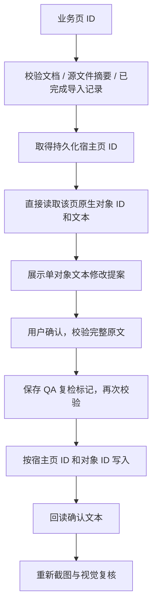

# PPT Agent 按业务页定位与文本修改实施小结（2026-09-23）

## 本轮完成

- 新增 `read_presentation_page`：以业务页 ID 查询已确认导入的页面；不传 `shape_id` 时列出原生对象，传入后读取指定对象文本。
- 新增 `edit_presentation_page_text`：以业务页 ID 和原生对象 ID 提出文本修改，沿用现有预览、确认、QA 失效、取消和回读机制。
- 业务页经源包 SHA-256、源页面顺序和完成检查点映射到实际宿主页；当前页码不参与新工具的定位。
- 宿主适配器直接调用 `slides.getItem(hostId)` 和 `shapes.getItem(shapeId)`，核对返回 ID；写入前再次完整比较预期原文。
- 页面重排后仍定位原宿主页。目标删除、被替换、文档变化、映射变化或项目生成物重新恢复时，旧提案拒绝执行。
- 列对象最多返回100个并显式标记截断；单对象文本限12000字符，工具输出限64KiB。
- 长旧文本的提案预览提供带标记的2000字符摘要，完整新文本仍可见；内部校验使用完整原文。安装提案前检查字节预算。
- 复用旧文本写入的取消与失败回读逻辑；原页码工具继续保留。系统提示明确原生 `shape_id` 来自读取结果，不能使用 SlideIR 元素 ID 替代。

## 验证

- 独立审查无重要发现；独立执行94项定向测试通过，包括旧索引编辑路径的55项回归。
- 跨层验证：读取对象和文本 → 业务页修改提案 → 将旧索引模拟为另一页 → 仅按原宿主页修改 → QA需复检 → 新截图与视觉判断。
- 覆盖目标删除、重新恢复项目、文档/映射/原文变化、取消、宿主ID不符、写入回读失败，以及长中文文本预算。
- 最终全仓 `npm test` 通过：5879项 Vitest 测试（另包含原有 Node/Rust 检查），其中 Office 插件695项。
- 全仓类型检查、全部变更 TypeScript 文件 ESLint、diff check通过。
- Office插件与Shell生产构建通过；插件仍有现有的大chunk提示。

## 边界

- 本轮新增稳定定位路径只覆盖对象读取和文本修改，图表、布局、图片及OOXML修改仍使用此前工具；没有自动宣称它们已完成同样改造。
- 需要已确认导入的页面检查点。旧生成物无检查点或页面已被替换时，不按标题、页码或相似文本猜测重绑定。
- 新路径要求PowerPoint API 1.10；对象列表截断时，不保证已枚举所有对象。
- Office.js没有原子比较并写入操作；最后预读与宿主sync之间仍存在竞态，异常状态不会通过自动覆盖回滚处理。
- Office相关验证使用mock；真实宿主重排、删除、跨平台行为及保存重开仍待实机验收。
- 未合并、推送或部署，继续保留隔离开发分支。

## 下一步

1. 将稳定页面定位扩展到布局与图片修改，并完善具体问题到修复建议的衔接。
2. 在真实PowerPoint验证页面重排、目标删除、取消和保存重开恢复。
3. 继续补齐单页生产/失败重编译与变更集恢复能力。
