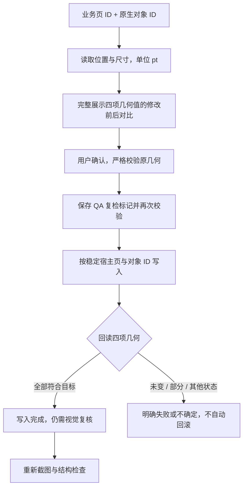

# PPT Agent 稳定页面布局修改实施小结（2026-09-23）

## 本轮完成

- 新增 `read_presentation_page_geometry` 和 `edit_presentation_page_geometry`，直接按稳定页面和原生对象 ID 读取、调整现有对象位置和尺寸。
- 支持文本框、图片等现有顶层形状的 `left/top/width/height` 四项属性；使用 PowerPoint 点（pt），不使用 SlideIR 的英寸。
- 输入严格限制四个有限数值，绝对值不超过100000，宽高非负；保留线条零宽/零高，允许有意放置画布外，越界另由QA检查。
- 修改提案显示完整原几何与目标几何。确认、持久化准备之后和实际写入前分别校验；用户手工移动对象后，旧提案停止执行。
- 写入回读沿用0.01pt容差处理宿主舍入；提交后的取消或sync失败仍会回读，全部符合目标才成功。部分写入和并发变化不自动覆盖回滚。
- 属性setter排队阶段异常或排队后、提交前取消时，直接报告状态不确定，不用同context的额外sync回读，避免主动提交尚未发出的半批写入。
- 修改接入上一轮QA失效、互斥和复检流程；适配器不支持新方法时，工具隐藏并拒绝调用。
- 文本修改与旧页码declarative工具保持兼容，不引入新持久化格式。

## 验证

- 跨层回归覆盖业务页读取几何、确认修改图片形状的位置/大小、QA失效、新截图与复核；全过程不调用旧页码文本修改。
- 验证确认前用户移动对象时停止写入，旧QA不会因被拒绝的提案误标为已修改。
- 独立审查发现并关闭setter异常后的队列误提交问题，同时补齐提交前取消边界；完成新路径、技能、运行时和QA整合的52项独立测试，并对最终取消修复独立重跑14项适配器测试，均通过。
- 最终全仓 `npm test` 通过：5900项 Vitest 测试（另包含原有 Node/Rust 检查），其中 Office 插件716项。
- 全仓类型检查、全部变更 TypeScript 文件 ESLint、diff check通过。
- Office插件与Shell生产构建通过；插件仍有现有的大chunk提示。

## 边界

- 本轮是图片等现有对象的移动与缩放，不包括图片内容替换、裁剪、旋转、组合内子对象或单页重生成。
- 不自动保持宽高比；模型需明确给出目标宽高，宿主实际结果由回读校验。
- 新路径仍要求PowerPoint API 1.10及已确认导入的检查点；不猜测重绑定缺失对象。
- Office.js没有原子CAS，最后预读与sync之间仍可能发生宿主竞态；不能将检查通过等同于并发风险完全消除。
- 相关宿主测试使用mock，真实PowerPoint的布局、跨平台行为与保存重开仍待实机验证。
- 本轮保持隔离分支，未合并、推送或部署。

## 下一步

1. 完善图片资产到现有页面的替换流程，处理对象ID变化与重新复检。
2. 在真实PowerPoint验收位置/尺寸修改、取消、部分写入和保存重开恢复。
3. 继续推进单页重生成与变更集恢复。
